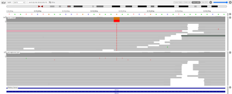
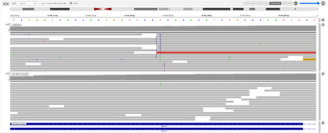
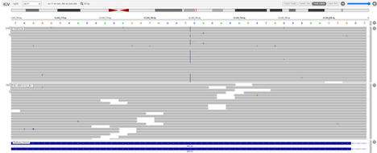
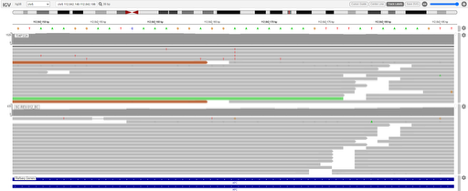
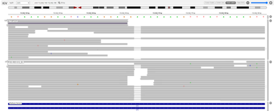
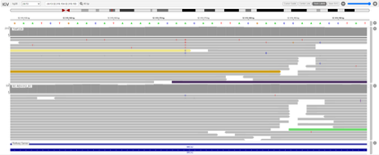
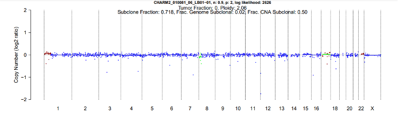
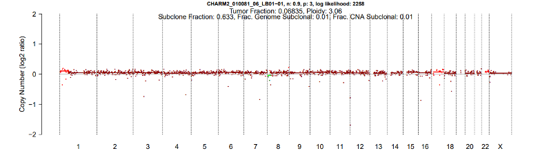
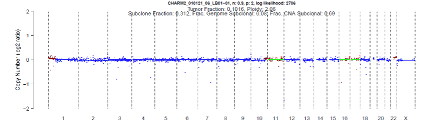
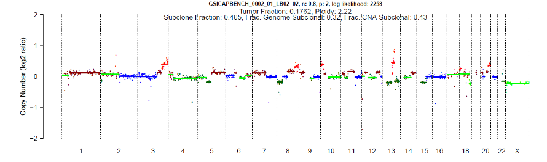

#################
Reporting Tips
#################

.. _alt-solution:

Alternative PURPLE solutions
###############################

When an alternate solution is better:

#. Search file_provenance for the alternate solutions directory::

	file_provenance=/scratch2/groups/gsi/production/vidarr/vidarr_files_report_latest.tsv.gz
	zcat $file_provenance | grep ${donor} | grep .purple_alternates.zip | cut -f 1,2,8,14,19,31,47

#. Copy the alternate solution zip file to your working directory.  
   Use the purple_summarize_alts.py script in `djerba_prototypes <https://github.com/oicr-gsi/djerba_prototypes/blob/main/scripts>`_  
   to see the potential purity and ploidy in each solution::

      python3 ~/git/djerba_prototypes/scripts/purple_summarize_alts.py .

#. Unzip the alternate directory and manually assign the purple outputs in the .ini. Solutions directories are labeled according to their ploidy; if your favoured solution has a ploidy between 1-2, choose ``sol1``; between 2-3, choose ``sol2`` etc. Specify your solution in the INI using::

	[wgts.cnv_purple]
	purple_zip = ${NAME}.purple.zip

#. Relaunch Djerba

If you still don’t like your solution, PURPLE can be relaunched manually, specifying the wanted purity and ploidy in the ``workflow.json`` for deployment in cromwell. Alternate solutions can be launched according to the following procedure

#. Open purple.alternate.json in the report folder and change the min/max purity/ploidy parameters (in string format) in the .json to match with your desired solution. Fill the tumour/normal bam/bai file directories as well, which can be fetched using the following command::

	file_provenance=/scratch2/groups/gsi/production/vidarr/vidarr_files_report_latest.tsv.gz
	zgrep ${DONOR} $file_provenance | grep .filter.deduped.recalibrated.bam | cut -f1,2,47,23,31,14
	zgrep ${DONOR} $file_provenance | grep .filter.deduped.recalibrated.bai | cut -f1,2,47,23,31,14

#. Clone `purple.wdl`_ to a local directory
#. Launch cromwell on the HPC with `purple.wdl`_ using the following::

	module load cromwell
	java -jar $CROMWELL_ROOT/share/cromwell.jar submit purple.wdl \
	 --inputs purple.alternate.json \
	 --host http://cromwell-dev-2.hpc.oicr.on.ca:8000 >purple.alternate.txt

#. Retrieve the workflow outputs from the `Cromwell workflow manager`_ using the workflow ID in purple.alternate.txt. Click the "OUTPUT" tab and copy the ".solPrimary.purple.zip" file stored in "purple_directory" to your working directory
#. Complete the procedure as in `alt-solution`_ above.

.. _purple.wdl: https://github.com/oicr-gsi/purple/blob/main/purple.wdl
.. _Cromwell workflow manager :  http://cromwell-job-manager-dev.gsi.oicr.on.ca:4202/jobs

.. _navigate-dimsum:

Navigating Dimsum
########################

#. Login using your OICR username and LDAP at https://dimsum.gsi.oicr.on.ca/
#. On the QC dashboard, scroll down to the case of interest, or go to filter -> donor -> type in the donor (ex. REVOLVE_0001).
#. Click on the case to see case details

.. _navigate-reqsys:

Navigating the Requisition System
##################################

#. Login using your OICR username and LDAP at https://requisition.genomics.oicr.on.ca/ 
#. From the dashboard submissions tab, navigate to the project.

	.. image:: images/reqsys1.png

#. Find the sample in the requisition system, click “View”, and scroll down to view information.
	
	#. Refer to Dimsum to find the “Requisition ID” within the requisition system, eg. `PANX_1608`_ -> PRSPR-427

	.. image:: images/reqsys2.png

.. _PANX_1608: https://dimsum.gsi.oicr.on.ca/donors/PANX_1608

.. _tar-whizbam-examples:

Interpreting variants in Whizbam
#################################

These are examples from targeted reports of true and false positives in :ref:`whizbam_infra` (IGV).

Example 1:

According to ``data_mutations_extended_oncogenic.txt``, this is a G -> T nonsense mutation. As this call has many supporting reads in the tumour but not in the normal, it is a confident call and should be kept for reporting.

Example 2:

According to ``data_mutations_extended_oncogenic.txt``, this is a frame-shift insertion. A frame-shift insertion is represented by a short purple line. This insertion can be better seen when scrolling down:

As the frame-shift insertion has no supporting reads in the normal, it is likely a confident call and should be kept for reporting.

* Examples of variants to remove

Example 1:

Upon initial review, this looks like a A -> T SNP call, as this variant does not have supporting reads in the normal. However, according to ``data_mutations_extended_oncogenic.txt``, this call is actually a frame-shift deletion. Indeed, when scrolling down, this frame-shift deletion is visible:

As this frame-shift deletion has supporting reads in the normal, it is likely to be an artifact and must be removed.

Example 2:

According to data_mutations_extended_oncogenic.txt, this call is actually a frame-shift insertion. A frame-shift insertion is represented by a short purple line (such as on the right of the above screenshot). As there are no short purple lines present in the tumour, this variant does not pass QC and must be removed. 

.. _tar-ichor-examples:

Interpreting ichorCNA CNV plots
################################

These are examples of CNV plots from ichorCNA for targeted reports.

* Example of a plot centered at 0 (it will appear blue):

* Example of a plot not centered at 0 (it will appear brown):

* Example of a high purity solution likely driven by potentially artifact chromosomal regions (ex. 1p, 17, 22):

* Example of a high purity solution which is likely correct:

.. _json-tips:

Working with JSON and Djerba
##############################

It is helpful to use json tools to make editing the Djerba json easier::

	$ cat djerba_report.json | python3 -m json.tool > report/djerba_report_machine.pretty.json
	$ vim report/djerba_report_machine.pretty.json
	$ djerba.py render -j report/djerba_report_machine.pretty.json -o report -p  

+----------------+----------------------+
| **Change Log** | `Github commit log`_ |
+----------------+----------------------+

.. _Github commit log : https://github.com/oicr-gsi/oicr-gsi/commits/main/source/data-review-reporting/report-tips.rst

