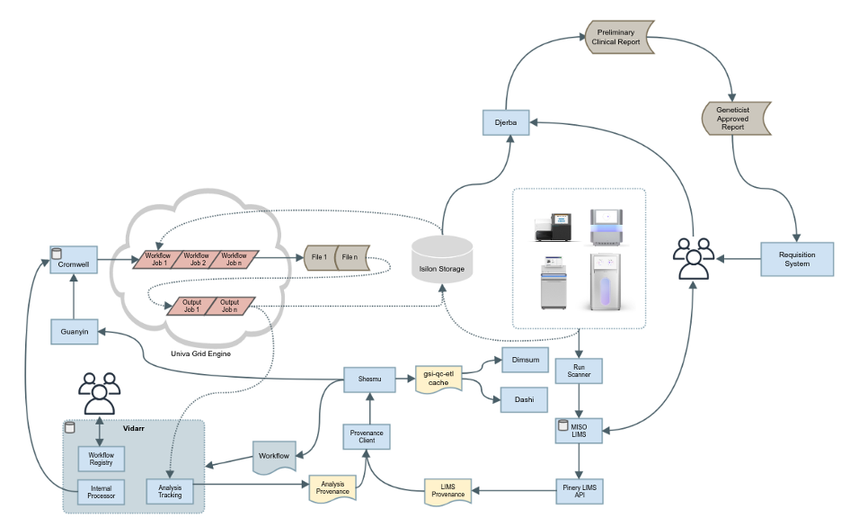
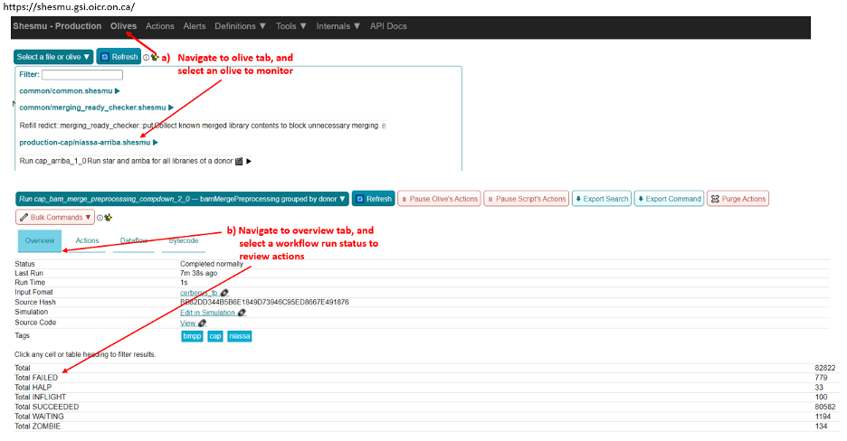
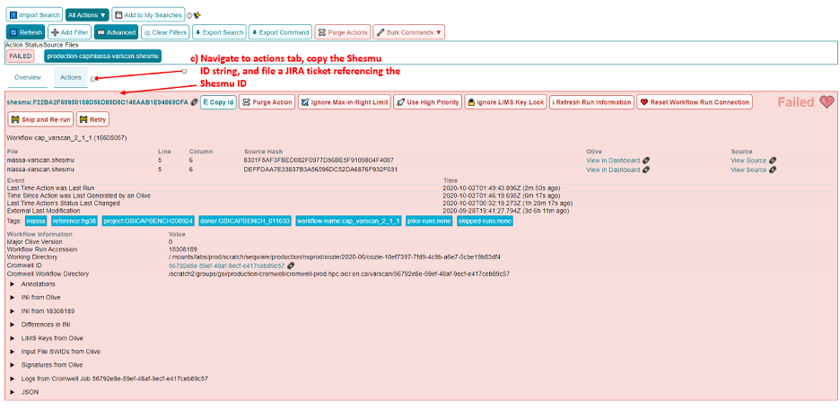

*********************
Informatics Overview
*********************

.. note:: 
	This document is part of the OICR Genomics Quality Management System : `TM-014 Informatics Pipelines🔒`_

The informatics pipeline consists of a combination of automated production software and manually executed scripts. A diagram illustrating the flow of data through individual components is shown in :numref:`high-level-overview`. More information about specific systems is available below.

This SOP describes steps 1 through 5. Steps 6 and 7 are described in TM. Data Review and Reporting Procedure.

1. The informatics pipeline commences once a sequencing run is complete, at which point Run Scanner registers the run as complete, and the laboratory information management system (LIMS) - MISO retrieves and stores this information. 
2. An automation and decision-making software Shesmu retrieves the status of completed runs from MISO’s API (Pinery), and in turn triggers the launching of bcl2fastq for generation of raw FASTQ files. 
3. Shesmu also interfaces with the provenance client - a series of files generated by the provenance client containing information about completed workflow runs in order to generate the instructions for launching the complete bioinformatics pipeline. 
4. After bcl2fastq is complete, subsequent bioinformatics analysis pipelines are launched by Vidarr. More details about the analysis pipelines is available in each assay_.
5. Once analysis is completed, ETL is responsible for retrieving, and subsequently transforming workflows with quality control information for display via Dashi and Dimsum. 
6. Additionally, an in-house application named Djerba (https://github.com/oicr-gsi/djerba) retrieves and transforms data containing mutation, copy number, structural variation, and expression calls into a tabular format for review by Cancer Genome Interpreters. This information is subsequently processed by Djerba to generate a PDF clinical report.
7. The final step in the process is digital signing and upload of the PDF to the sample requisition system.

.. _TM-014 Informatics Pipelines🔒: https://oicr.sharepoint.com/:w:/r/sites/OGQM/SOPs/Informatics%20Pipelines.docx?d=wc3a852b0516044ada1b6453bd74b26ce&csf=1&web=1&e=AovWyy

.. _assay: reference.html

.. _high-level-overview:

   **High-level overview of the informatics pipeline architecture.** The clinician or their representative submits a requisition with information about a patient and their clinical metadata (non-PHI) which is approved by laboratory managers in the Requisition system. The requisition ID is transferred by Tissue Portal to associate a specific set of Tissues with the requisition in MISO LIMS. After sequencing is completed, the completed run and its configuration and quality metrics are registered by Run Scanner. This information is pulled into MISO LIMS, and the Run appears in the interface for laboratory personnel to attach to pool information (a pool of libraries). MISO exposes this information via its API, Pinery. Shesmu retrieves the information about the libraries and the sequencing run and uses it to launch a series of pipeline steps, which produce raw pipeline output. This output is registered in Provenance and used by GSI-QC-ETL to display quality control information in Dashi and Dimsum. This output is further used in combination with information from the Requisition system, MISO, Provenance, and ETL by Djerba to produce a preliminary clinical report for review. The preliminary report is checked and refined by an Analyst, who then uses additional functions of Djerba to create the unsigned report ready for the Geneticist to review. The signed report is then attached to the original requisition in the Requisition system for return to the clinician.  

********************
Updates and Upgrades
********************

Although every effort is made to ensure that the processes laid out in these QMS documents are complete and correct, software must occasionally be updated to support new features, changes in system integration or bug fixes. 

With the exception of the software detailed below, software and pipelines that support or underpin accredited assays. Any research-related changes will not trigger an update process. Production configuration is kept separately; software installed for production is also kept separately; and informatics pipelines are installed specifically for clinically-reported assays (ACD/CAP).

Several mechanisms can trigger changes to software: 

1.	User-submitted bug reports and tickets, submitted and prioritized as described in QM. LIMS Issue Management Plan;
2.	Notifications from Research IT. Research IT regularly scans all OICR-operated software looking for vulnerabilities and will notify us of any issues.
3.	Errors during informatics pipeline execution may also trigger bug reports as in #1. Workflows contain self-checking steps that ensure that results are consistent.

General Procedure
==================

All informatics pipelines and infrastructure follow software engineering best practices for software development. The following is the general procedure followed by every software used in production.

1.	Changes are made to a copy of the software, saved in a version-controlled ‘branch’ in the software repository.
2.	The developer issues a "pull request" (change request) that describes what is being changed and why.
3.	The changes are peer reviewed and signed off by at least two reviewers. This sign-off is dated and versioned with the signatory’s name and kept in perpetuity.
4.	The changes are merged in with the software repository.
5.	If an SOP change is required (including but not limited to this SOP, QM. Quality Control and Calibration Procedures or TM. Data Review and Reporting), a QW. Software Update Form should be filed by the change requestor.
6.	The changes are deployed to the development and staging environments for testing and evaluation.
7.	If a Software Update form is required, deployment to production must await validation (if necessary) and/or sign-off on the Software Update Form.
8.	Once the software is performing as expected in those environments, we deploy changes to production
9.	Through the use of monitoring, logging, and change history we are able to identify when updates and upgrades are not performing as expected. Because everything is versioned, we are able to ‘roll back’ changes if necessary.

Any significant changes made to software that impact procedures in the QMS trigger updates to SOPs using the QM. Document Control Plan.

MISO LIMS
=========

MISO LIMS is actively developed to support new data types, user feature requests, bug fixes and security updates. One deployment is used by both research and accredited laboratory processes. MISO follows a scheduled release cycle in which all changes since the last release are combined and released together. Note that Software Update Forms are not required for MISO releases.

Changes to the MISO code base proceed as follows:

1.	MISO is updated, a pull request is made, and reviewed as in the general procedure.
2.	The changes are automatically tested using continuous integration to ensure no unwanted behaviour is introduced and that previously found regressions are not reintroduced. 
3.	If both review and continuous integration pass, the changes are merged to the repository. 
4.	A detailed release procedure is used for deployment to staging and production environments (https://wiki.oicr.on.ca/display/MISO/Release+Procedure). It involves manually testing the new features, ensuring that the LIMS provenance data exported to analysis has not changed unexpectedly or in an incompatible way and MISO integration with other systems is not broken. 
5.	Once the update is available in staging, changes to MISO are communicated to users via email and users are given time to preview and test features in staging. 
6.	After the preview period, the release to production is then performed at the scheduled time, users are given a demo of new features in their lab meeting, and then are notified that they may resume using MISO production.

Dashi
=====

Dashi is actively developed to support new report types, metrics, bug fixes and security updates. One Dashi instance (https://dashi.oicr.on.ca) supports both accredited processes and research processes, so it is updated regularly. Dashi follows a scheduled release cycle in which all changes since the last release are combined together. Note that Software Update Forms are not required for Dashi releases.

Changes to Dashi proceed as follows:

1.	Dashi is updated, a pull request is made, reviewed, and merged as in the general procedure.
2.	A detailed release procedure is used for deployment to staging and production environments (https://wiki.oicr.on.ca/pages/viewpage.action?pageId=137528978). It involves reviewing that input metrics data can be loaded and reports can be generated. 
3.	Once the updates are available in staging, changes to Dashi are communicated to users via Slack and users are given time to preview and test features in staging.
4.	After the preview period, release to production is performed at the scheduled time and users are given a demo of the new features.

Dimsum
=======

Dimsum is actively developed to support new features, metrics, bug fixes, and security updates. One Dimsum instance (https://dimsum.gsi.oicr.on.ca) supports both accredited and research processes, so it is updated regularly. Dimsum follows a scheduled release cycle in which all changes since the last release are combined together. Note that Software Update Forms are not required for Dimsum releases,

Changes to Dimsum proceed as follows:

1.	Dimsum is updated, a pull request is made, reviewed, and merged as in the general procedure.
2.	A detailed release procedure is used for deployment to staging and production environments (https://wiki.oicr.on.ca/x/hAOSD)
3.	Once the updates are available in staging, changes to Dimsum are communicated to users via email and users are given time to preview and test features in staging.
4.	After the preview period, release to production is performed at the scheduled time and users are given a demo of the new features.

Pipeline and infrastructure configuration
=========================================

Production configuration determines which servers run the software, perform backups, and log statuses, and also determine how the pipeline fits together. The vast majority of changes to configuration and infrastructure will not impact analysis or the final report, and follow the General Procedure detailed above. On the occasions where changes will impact analysis and/or change SOPs, a Software Update form must be filled in, and validation may be required before it can be deployed. All changes regardless of impact are recorded in the commit log at https://bitbucket.oicr.on.ca/projects/GSI/repos/analysis-config/commits for pipeline configuration, and https://bitbucket.oicr.on.ca/projects/GSI/repos/infrastructure/commits for infrastructure.

Pipeline software components and workflows
===========================================

Occasionally, the informatics pipelines themselves will require updates, although these are specific to the accredited informatics pipelines and so these updates are rare. They also follow the same general procedure for upgrades detailed above. 

1.	The informatics pipeline is updated, a pull request is made, and reviewed.
2.	Changes in the pull request are automatically tested using continuous integration to ensure that the output from the analysis workflow remains unchanged (or that the change in output is expected).
3.	If both review and continuous integration pass, the changes are merged to the repository.
4.	Analysis workflow updates follow a release procedure from development, through testing (staging), and thorough to production (https://wiki.oicr.on.ca/display/GSI/Workflow+and+Olive+Release+Checklist).
5.	If analysis output is unchanged (in the case of security patches or other updates that will not change the output), pipelines are updated to the latest analysis workflow version.  
6.	If the pipeline changes the analysis results, the pipeline is rerun with validation samples to confirm that the analysis results are as expected. These changes are then documented in the relevant SOPs and the change is released into production.

*************************************
Variables and Observations to Record
*************************************

Quality control metrics are reviewed as described in the QM. Quality Control and Calibration Procedures SOP.

Procedure
==========

The informatics pipeline is automatic and controlled by the decision-making software, Shesmu. The following steps describe the roles of pipeline leads, whose responsibility is general oversight of all aspects of pipeline automation, as well as the Cancer Genome Interpreters who depend on completion of the pipeline. In general, the procedure for pipeline leads consists of monitoring workflow run statuses in Shesmu, and acting when there is an error. While pipeline leads are primarily responsible, Cancer Genome Interpreters may also monitor workflow run statuses and file JIRA tickets for the pipeline leads to follow-up.

The automated actions of the pipelines are described in subsequent sections for the specific analysis pipelines.

Monitoring pipeline
===================

1.	Once a sequencing run is marked in MISO as complete, an e-mail is automatically sent to gsi-qc@lists.oicr.on.ca, indicating that the run is complete to review on sequencer metrics (the procedure for lab personnel reviewing run QC metrics is described in QC SOP).
2.	Pipeline leads monitor the automation system and analysis runs depicted in :numref:`shesmu-pipeline-lead`. The full procedure for monitoring the pipeline status and resolving common issues is listed in the Pipeline Lead Role documentation. In short, pipeline leads 1) watch for automated alerts (email, JIRA, and Slack) from the software infrastructure indicating problem with computers or upstream data; 2) check the Pipeline Lead Dashboard in the Shesmu UI for any errors related to analysis runs; 3) check Grafana for the presence of ERROR or STALE records in provenance, which indicates that a change was made in LIMS to files that were previously analyzed. Pipeline leads will attempt to resolve any issues they encounter that are transient and related to software or hardware failures (common in high-throughput computing environments) or will contact CGI for any issues arising from data analysis.
3.	Cancer Genome Interpreters may also monitor the status of workflow runs and file tickets for follow-up from the pipeline lead. The following is an example of monitoring the bcl2fastq olive, which is the first olive launched upon completion of a sequencing run :numref:`shesmu-pipeline-lead`:

	a.	Pipeline leads navigate to Shesmu UI to monitor workflow run statuses.
	b.	Workflows in the “HALP” or “FAILED” state are investigated further by clicking “Drill Down” which is displayed after clicking on the workflow status.
	c.	Actions that require immediate follow-up by pipeline leads and be ticketed in JIRA by referencing the shesmuID for individual actions.

4.	Once all pipelines are completed, Clinical Genome Interpreters proceed with the TM. Data Review and Reporting SOP.

.. _shesmu-pipeline-lead:

	**Representation of procedure for monitoring workflow run statuses:** Checking for failed workflow runs and filing a JIRA ticket for pipeline leads to follow up.

The entire pipeline is automated and, in the ideal case, requires no human intervention.

.. toctree::
   :maxdepth: 2

+----------------+----------------------+
| **Change Log** | `Github commit log`_ |
+----------------+----------------------+

.. _Github commit log : https://github.com/oicr-gsi/oicr-gsi/commits/main/source/informatics-pipelines/informatics-pipelines.rst