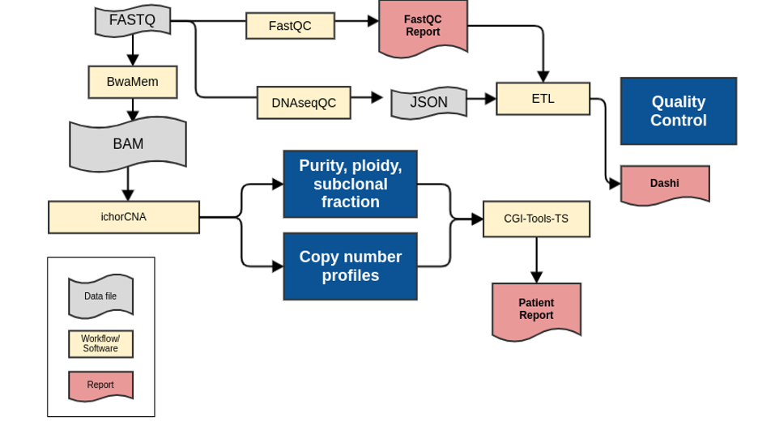

.. assays:

##################
Assays
##################

* :ref:`wgts-pipeline`
* :ref:`tar-pipeline`               
* :ref:`shallow-pipeline`                   
* :ref:`plasma-pipeline`                       

Reference Files
###################

=================================== =============================== =============================== =========================
Reference                           Version                         Source                          Internal
----------------------------------- ------------------------------- ------------------------------- -------------------------
Human Genome Reference              |hg38-version|                  |hg38-ref-remote|               |hg38-ref-local|
Whole-genome interval file          |hg38-version| all intervals                                    |wgs-intervals|
Exome interval file for callability Agilent SureSelect Exome V6     |callability-exome-remote|      |callability-exome-local|
TS REVOLVE revolve-panel            |revolve-panel-paper|           |revolve-panel-remote|          |revolve-panel-local|
=================================== =============================== =============================== =========================

.. _wgts-pipeline:

Whole Genome and Transcriptome (WGTS) version |wgts-version|
#############################################################

Whole Genome
-------------
.. _wgs-pipeline:

.. figure:: images/wgs-pipeline.png
	
	**Whole Genome Sequencing Analysis Pipeline**

1.	The whole genome pipeline commences once the bcl2fastq workflow is completed and FASTQ files are available (not shown). 
2.	FASTQ files are quality controlled using FastQC. FastQC produces quality control metrics related to reads (e.g. total numbers of reads).
3.	FASTQ files are aligned with BwaMem2 to generate an unprocessed lane-level BAM file. 
4.	Cases are quality controlled with the - bamQCworkflow generating a JSON file of lane-level alignment QC metrics for review. The quality control metrics include the insert size distribution, amount of duplication, mapping percentage, and other WG ‘Single Lane’ metrics described in QM. Quality Control and Calibration Procedures.  Genomic fingerprints are generated from lane-level alignments and made available to sample authentication procedures.
5.	Cases are quality controlled again with bamQC running on the merged set of all lane-level alignments generating a JSON file of call-ready alignment QC metrics for review. In addition to the lane-level QC metrics this includes an assessment of the per-sample depth of coverage (QM. Quality Control and Calibration Procedures).
6.	All lane-level BAM files are collected and processed via BamMergePreProcessing, which merges and sorts lane-level BAMs, as well as performing  duplicate marking, and base quality score recalibration to generate a call-ready sample-level BAM..
7.	These normal and tumour BAM files are used as input for the variant calling workflows.

	a.	MuTect2 generates SNV and INDEL mutation calls in vcf format, which are annotated by VariantEffectPredictor, generating a MAF file of annotated calls.
	b.	GRIDSS and Delly generate somatic structural alterations in VCF format. The Delly vcf is post-processed by MAVIS to generate calls in TSV format, in addition to graphical representations of the structural event in SVG format. 
	c.	The GRIDSS vcf is post-processed by Purple and used for evidence to support copy number calls, loss of heterozygosity status, and estimate tumour purity.
	d.	msisensor calls the proportion of microsatellite sites with evidence of variants between T-N to produce a microsatellite score recorded in a .TXT file.
	e.	HRDetect calls the homologous recombination deficiency (HRD) status using the Mutect2 vcf file, and the GRIDSS vcf file as input. The output file is a json file containing the HRD results.
	f.	T1K reports germline HLA typing alleles by estimating allele abundances from input read alignments. The output is a TSV file that includes the identified HLA alleles, their abundance, quality, and any secondary alleles.

8.	All alteration files are provided to Djerba to generate a provisional clinical report for review by genome interpreters.

WGS Workflows and Software
^^^^^^^^^^^^^^^^^^^^^^^^^^

More information about the analysis pipelines is available in the ‘Procedure’ section below. Workflow parameterization is automated through the linked Shesmu configuration. This repository is restricted to authorized individuals.

* Human Genome Reference: |hg38-version|
	* Source: |hg38-ref-remote|
	* Local fasta: |hg38-ref-local|

.. csv-table:: Whole Genome Sequencing Software
   :file: software/wgs.csv
   :widths: 30, 30, 30, 30, 30
   :header-rows: 1

Whole Transcriptome
--------------------

.. _wts-pipeline:

.. figure:: images/wts-pipeline.png

	**Whole Transcriptome Sequencing Analysis Pipeline**

1.	As with the WGS informatics pipeline, the whole transcriptome pipeline commences once FASTQ files are generated from bcl2fastq. 
2.	FASTQ files are aligned with the STAR workflow, generating genome-aligned and transcriptome-aligned BAM files. STAR also outputs a TSV file of chimeric junctions which is used as input for the STAR-Fusion workflow. 
3.	The FASTQ files are also provided to RNASeqQc which generates a JSON file of QC metrics for plotting via Dashi. The quality control metrics include the WT ‘Single Lane’ metrics described in QM. Quality Control and Calibration Procedures. Genomic fingerprints are generated from lane-level alignments and made available to sample authentication procedures.
4.	The transcriptome-aligned BAM file is provided as input to RSEM, generating FPKM values and normalized expression counts in tabular format. 
5.	RNA fusion calls are generated from STAR-Fusion and Aribba.  Both are used as input to to MAVIS for validation and annotation.
6.	All alteration files are provided to Djerba to generate a provisional clinical report for review by genome interpreters.

TS Workflows and Software
^^^^^^^^^^^^^^^^^^^^^^^^^^^^^^^^^^^

More information about the analysis pipelines is available in the ‘Procedure’ section below.  Workflow parameterization is automated through the linked Shesmu configuration. This repository is restricted to authorized individuals.

.. csv-table:: Whole Transcriptome Sequencing Software
   :file: software/wts.csv
   :widths: 30, 30, 30, 30, 30
   :header-rows: 1

.. _tar-pipeline:

Targeted Sequencing (TAR) version |tar-version|
#############################################################

.. figure:: images/tar-pipeline.png

	**Targeted Sequencing Analysis Pipeline**

1.	As with the WGTS informatics pipeline, the targeted sequencing pipeline commences once FASTQ files are generated from bcl2fastq. 
2.	FASTQ files are aligned with BwaMem to generate an unprocessed lane-level BAM file.
3.	Cases are quality controlled with the bamQC workflow generating a JSON file of lane-level alignment QC metrics for review. The quality control metrics include the insert size distribution, amount of duplication, mapping percentage, and other TAR ‘Single Lane’ metrics described in QM. Quality Control and Calibration Procedures.  Genomic fingerprints are generated from lane-level alignments and made available to sample authentication procedures.
4.	All lane-level BAM files are collected and processed via BamMergePreProcessing, which merges and sorts lane-level BAMs, as well as performing  duplicate marking, and base recalibration to generate a call-ready sample-level BAM.
5.	The FASTQ files are also processed with ConsensusCruncherWorkflow to generate UMI-tagged and consensus-collapsed bam files. The ConsensusCruncherWorkflow  uses MuTect2 followed by Variant Effect Predictor to generate raw call files, and HSMetrics to generate collapsed coverage metrics. For variant calling, the duplex consensus sequences and single-stand consensus sequence with singleton corrected bam files are used to generate raw calls, which are then annotated with the variant allele frequency from the all-unique bam file.
6.	All alteration files are provided to Djerba to generate a provisional clinical report for review by genome interpreters.

TAR Workflows and Software
---------------------------

* Human Genome Reference: |hg38-version|
	* Source: |hg38-ref-remote|
	* Internal fasta: |hg38-ref-local|
* REVOLVE panel: |revolve-panel-paper|
   * Internal link: |revolve-panel-local|

.. csv-table:: Targeted Sequencing Software
   :file: software/tar.csv
   :widths: 30, 30, 30, 30, 30
   :header-rows: 1
.. _shallow-pipeline:

Shallow Whole Genome (sWGS) version |shallow-version|
#############################################################

	**Shallow Whole Genome Analysis Pipeline**

1.	The shallow whole genome pipeline commences once the bcl2fastq workflow is completed and FASTQ files are available. 
2.	FASTQ files are quality controlled using FastQC. FastQC produces quality control metrics related to reads (e.g. total numbers of reads)
3.	FASTQ files are aligned with BwaMem2 to generate an unprocessed lane-level BAM file. 
4.	Data is quality controlled with the bamQC workflow generating a JSON file of alignment QC metrics for review. The quality control metrics include the insert size distribution, amount of duplication, mapping percentage, and other WG ‘Single Lane’ metrics described in QM. Quality Control and Calibration Procedures.
5.	The BAM files are processed with ichorCNA to estimate tumour fractions in ultra-low pass whole genome sequencing (WGS) and prediction of large-scale copy number variation (CNV).
6.	All alteration files are provided to Djerba to generate a provisional clinical report for review by genome interpreters.

sWGS Workflows and Software
----------------------------

* Human Genome Reference: |hg38-version|
	* Source: |hg38-ref-remote|
	* Local fasta: |hg38-ref-local|

.. csv-table:: Shallow Whole Genome Sequencing Software
   :file: software/swgs.csv
   :widths: 30, 30, 30, 30, 30
   :header-rows: 1

.. _plasma-pipeline:

Plasma Whole Genome (pWGS) version |pwgs-version|
#############################################################

.. figure:: images/plasma-pipeline.png

	**Plasma Whole Genome Analysis Pipeline**

1.	The plasma whole genome pipeline commences once the bcl2fastq workflow is completed and FASTQ files are available (not shown). 
2.	FASTQ files are quality controlled using FastQC. FastQC produces quality control metrics related to reads (e.g. total numbers of reads).
3.	FASTQ files are aligned with BwaMem2 to generate an unprocessed lane-level BAM file. 
4.	Cases are quality controlled with the bamQCworkflow generating a JSON file of alignment QC metrics for review. The quality control metrics include the insert size distribution, amount of duplication, mapping percentage, and other WG ‘Single Lane’ metrics described in QM. Quality Control and Calibration Procedures.
5.	Cases are quality controlled again with bamQC running on the merged set of all lane-level alignments generating a JSON file of call-ready alignment QC metrics for review. In addition to the lane-level QC metrics this includes an assessment of the per-sample depth of coverage (QM. Quality Control and Calibration Procedures).
6.	All lane-level BAM files are collected and processed via BamMergePreProcessing, which merges and sorts lane-level BAMs, as well as performing duplicate marking, and base quality score recalibration to generate a call-ready sample-level BAM.
7.	The plasma whole genome BAM file and an existing whole genome sequencing vcf file from matched donor are used as input for the mrdetect workflow.

	a.	MRDetect detects SNVs from WGS VCF in plasma BAM
	b.	MRDetect detects SNVs from WGS VCF in healthy blood control (HBC) cohort
	c.	Metrics are computed on the confidence of minimal residual disease detection

8.	All alteration files are provided to Djerba to generate a provisional clinical report for review by genome interpreters.

pWGS Workflows and Software
-----------------------------

More information about the analysis pipelines is available in the ‘Procedure’ section below. Workflow parameterization is automated through the linked Shesmu configuration. This repository is restricted to authorized individuals.

.. csv-table:: Plasma Whole Genome Sequencing Software
   :file: software/pwgs.csv
   :widths: 30, 30, 30, 30, 30
   :header-rows: 1