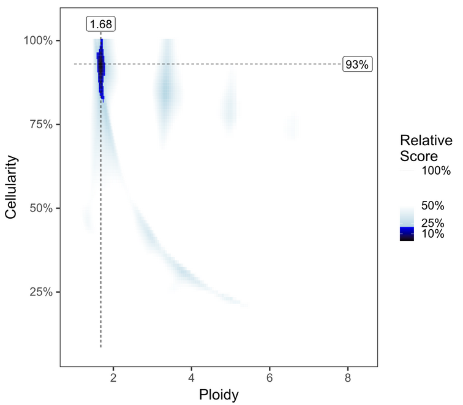
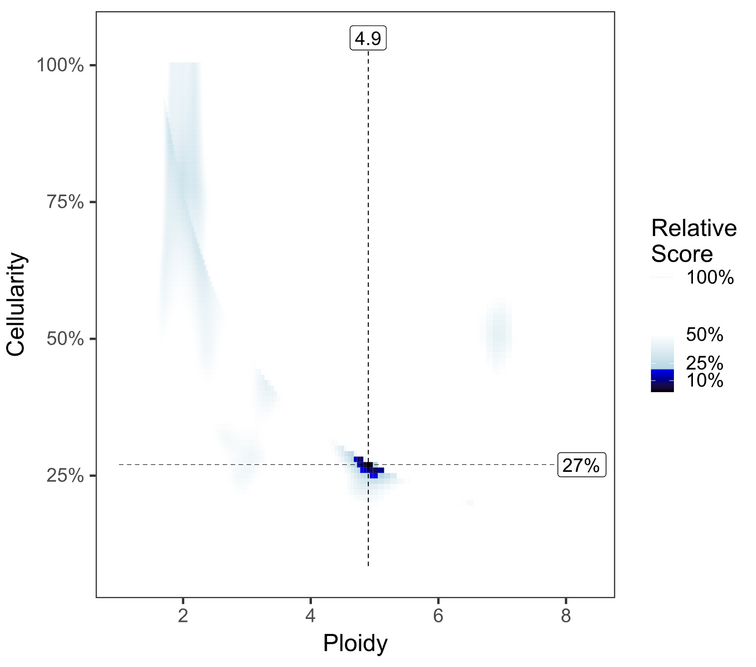
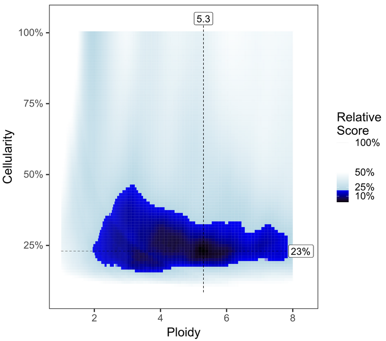
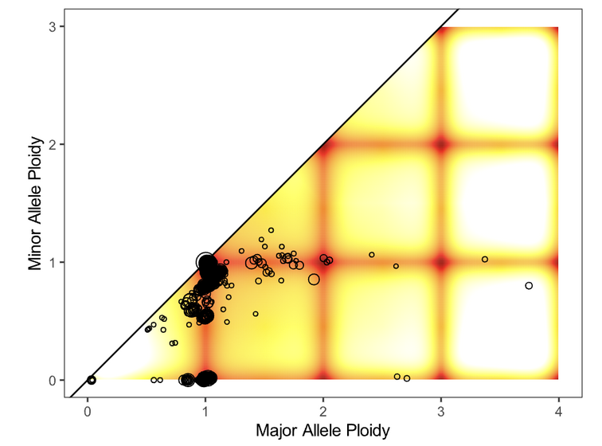
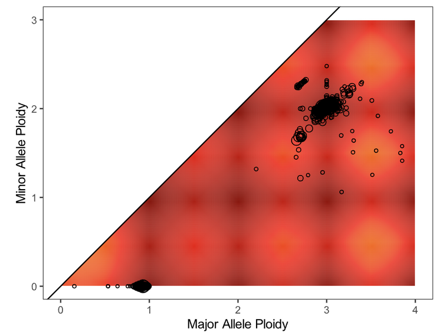
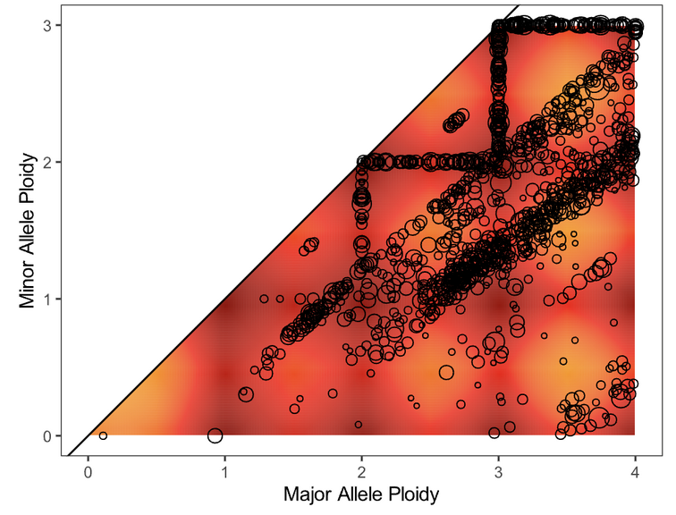

Overview of Clinical Report Generation Procedure
#################################################

The report generation procedure involves trained CGI staff carrying out specific additional analysis and interpretation of variant calls and quality metrics output by the standardized bioinformatics pipelines. Either the CGI manager or an assigned member of CGI acts as a clinical reporting lead. Details on this role are outlined on the `wiki page`_. They are responsible for checking the status clinical reports on Dimsum_ and delegating. Interim clinical reports are generated using Djerba. CGI then generates a draft report by interpreting and editing the interim report for subsequent review and sign-out by a geneticist.

.. _wiki page: https://wiki.oicr.on.ca/display/GSI/Be+Clinical+Reporting+Lead
.. _Dimsum: https://dimsum.oicr.on.ca/?PIPELINE=Accredited+with+Clinical+Report&PENDING=Analysis+Review+-+Clinical+Report

In brief, the procedure follows these steps:

1. Set up a working directory to contain intermediate files
2. Create the report - these steps are Assay Specific

    a. Complete configure file with parameters specific to the assay. Non-PHI patient data (sample type, cancer type, anatomical location) from the requisition system is entered in the Djerba config file, and appears in the interim report.
    b. Generate an interim report. Using Djerba, convert the config file to html report
    c. Interpret interim report. 

        i. Review each section of the report to familiarize yourself with actionable and oncogenic variants
        ii. Write a `clinical interpretation statement`_ and insert into interim report

    d. Finalize draft report. Convert the html to the draft pdf
    e. Considerations for Failed reports are given at the end of each assay’s section

3. Review Draft Report meets ISO requirements
4. Download the quality control (QC) report using the case report button in the Dimsum system.
5. Upload the draft report and QC report to the Requisition System for review and sign-out by a Geneticist (see `Requisition and Reporting System Manual`_).
6. If a report is rejected by the Geneticist, it must be reviewed and resubmitted.

.. _clinical interpretation statement: https://wiki.oicr.on.ca/display/GSI/Write+a+Genome+Interpretive+Statement
.. _Requisition and Reporting System Manual: https://oicr-gsi.readthedocs.io/projects/requisition-system/stable

The steps in section 2 outline the procedure for each of the three assays supported by Djerba. There are individual sections for assay specific configuration and interpretation. Further, the step at which QC is evaluated and recorded in MISO changes among assays, as outlined in each respective procedure. 

    1. Whole Genome and Transcriptome Sequencing (WGTS)
    2. Targeted sequencing (TAR)
    3. plasma Whole Genome Sequencing (pWGS)

For considerations of variant classification, incidental findings and analytical methodology changes, see Additional Considerations at the end of this document.

**Example Terminology:**

1. Donor: refers to the MISO-generated patient identifier (eg. OCT_010118)
2. Requisition: a unique ID used to track the assay request for service. The requisition ID is the organizing unit of a case. It is identified through the requisition-system and each requisition will lead to one report. There may be multiple requisitions for one donor therefore we focus specifically on requisitions as the functional unit.
3. Project: refers to the project name as entered in the LIMS (eg. OCTCAP)
4. groupID: a unifying identifier for a group of libraries (or just one library) that will be analyzed as a unit. For example, top-ups will be grouped under one group-id. Similarly, several extractions from one tumour sample can be analyzed together under one group-id. Libraries with the same group-id are merged in the pipeline. DNA and RNA libraries use the same groupID (e.g. OCT-01-0118-TS) to define an analysis to be completed together. The groupID is an identifier used in MISO which indicates libraries that are to be processed together, thus resulting in a call-ready bam file. In other words, two samples derived from the same tissue with the same groupID will be merged into a single bam file. Often, the groupID is equivalent to the “Sample Study ID” from the sample requisition system as described in the TM. Sample Accessioning Procedure SOP.

In this SOP, the donor alias OCT_010118 or ${DONOR} will be used as an example to generate a WGTS, a TAR, and a pWGS report.  The example commands and filesystem paths will generalize to other samples and projects.

Creating Reports
##################

0. Before Starting
==================

Informatics pipelines must have completed as described in the :doc:`informatics-pipelines` SOP.

When informatics pipelines have completed, a Jira ticket will be created in the CGI Jira queue and assigned to a CGI staff member by the clinical reporting lead. This ticket is specific for CGI staff and indicates when all workflows for a requisition have completed. The ticket is meant to be a trigger for CGI staff to begin with this SOP, and contains the information needed to proceed with the procedure. If the clinical reporting lead is unavailable, delegation responsibility falls to the CGI Manager, then the Director, GSI. This begins the Data Review and Reporting Procedure.

1. Setting up a Djerba working directory
========================================

Analysis is carried out on the Univa cluster as the svc.cgiprod user and all work is to be completed under the /.mounts/labs/CGI/cap-djerba/ base directory. Set up the analysis environment as follows:

# Log into a Univa cluster head node, with the CGI staff’s username. For more information on logging into the OICR vist OICR’s `HPC school`_ 
b. Switch to the svc.cgiprod user account using the sudo command: ``sudo -u svc.cgiprod -i`` followed by ``qrsh``, with appropriate options, to open a session on a compute node.
# Load Djerba_ and its prerequisites: ``module load djerba``. It is normal to see a few warning messages on module load. If in doubt as to whether it has run successfully, run ``echo $?`` immediately afterwards to check the return code, which should be 0 (zero).
# create a working directory in CGI space to contain intermediate files. The working directory will be contained within a base directory specific to the project, donor, and requisition.
# djerba.py requires a report directory. It may also have a separate scratch directory; otherwise, ancillary files will be written to the report directory. Make a directory called “report” inside the working directory.
# To generate an INI config file, use the ‘setup’ mode of djerba.py with the name of the appropriate assay (one of WGTS, WGS, TAR or PWGS). This will create a config file called ‘config.ini’. 

.. _HPC school: https://www.google.com/url?q=https://gitlab.oicr.on.ca/ResearchIT/hpc-school/-/blob/master/hpc-intro.md%23logging-onto-a-head-node&sa=D&source=docs&ust=1699549033261016&usg=AOvVaw0HETLo4tBLeyEO1HJ2hIHE
.. _Djerba: https://github.com/oicr-gsi/djerba

Use the ``--compact`` flag to generate an INI file with only the minimum required parameters. Other parameters may need to be modified, for example if report_version in the [core] section requires a value other than 1; in this case, the ``--compact`` flag may be omitted.

Use ``--pre-populate`` flag (or ``-p PATH``) to specify the path to an existing INI file specific to the project. Its key/value pairs will be merged into the newly generated config.ini, automatically filling in those parameters so you don’t have to enter them manually. If there’s no project INI file yet, just omit this flag.
Detailed information on completing the config file is found in the dedicated assay sections below::

	$ WORK_DIR=$BASE_DIR/$PROJECT/$DONOR/$REQUISITION
	$ mkdir ${WORK_DIR}/report
	$  djerba.py setup --assay $ASSAY --ini ${WORK_DIR}/config.ini --compact --pre-populate $BASE_DIR/$PROJECT/${project_name}-config.ini

	#example
	$WORK_DIR=/.mounts/labs/CGI/cap-djerba/PASS01/PANX_1234/PASS01UHN-000
	$PROJECT_DIR=/.mounts/labs/CGI/cap-djerba/PASS01
	$ mkdir ${WORK_DIR}/report
	$ djerba.py setup --assay $WGTS --ini ${WORK_DIR}/config.ini --compact --pre-populate ${PROJECT_DIR}/PASS01-config.ini

Once a working directory has been set up, a report must be generated according to the assay listed in the requisition. Currently, Djerba supports the generation of clinical reports for the following assays: WGTS, TAR, and PWGS.

The instructions for generating reports for each assay are documented below. An example command line session is included at the end of each section. 

Creating Whole Genome Transcriptome Sequencing (WGTS) Reports
===================================================================

Djerba INI configuration
~~~~~~~~~~~~~~~~~~~~~~~~~~~~~~~~~~~

The config.ini file created in Step 1 is empty by default and some fields must be filled by the CGI staff. The INI can be edited either in the command line (using nano or vim) or using a text editor.  An empty INI is shown below. Values shown as REQUIRED must be filled in by the CGI staff. The example file was generated for the WGTS assay. It is an illustrative example only; plugin parameters may change from time to time. The automatic setup in Step 1 will create a config.ini file with up-to-date parameters::

	[core]

	[input_params_helper]
	assay = REQUIRED
	donor = REQUIRED
	oncotree_code = REQUIRED
	primary_cancer = REQUIRED
	project = REQUIRED
	requisition_approved = REQUIRED
	requisition_id = REQUIRED
	sample_type = REQUIRED
	site_of_biopsy = REQUIRED
	study = REQUIRED

	[wgts.cnv_purple]

	[report_title]

	[patient_info]

	[expression_helper]

	[provenance_helper]

	[wgts.snv_indel]

	[genomic_landscape]

	[case_overview]

	[fusion]

	[hla]

	[sample]

	[summary]

	[supplement.body]

	[gene_information_merger]

	[treatment_options_merger]

The underlying INI syntax conforms to the Python ConfigParser_ module. Empty parameters do not require specification and can be left out of the .ini – section headers (denoted by square brackets) are used by Djerba to discover which plugins to load and therefore must be included even if all parameters are left blank. 

.. _ConfigParser: https://docs.python.org/3/library/configparser.html

Summary of INI parameters:

The parameters below are entered in the ``[input_params_helper]`` section of the INI file and the information is obtained either from one of two Data Sources: the Requisition (Req) system or Dimsum.

===================== ================================================================================ ===============
INI parameter          Description                                                                      Data source
===================== ================================================================================ ===============
assay                  One of WGTS, WGS, TAR, PWGS                                                      Req system
donor                  Donor LIMS ID, eg. PANX_1249                                                     Dimsum
oncotree_code          OncoTree code, case-insensitive (eg. paad)                                       Req system
requisition_approved   Date of first requisition approval by Tissue Portal staff in yyyy-mm-dd format   Req system
project                name of the project in provenance                                                Dimsum
requisition_id         I.D. in requisition system                                                       Req system
sample_type            Select submission type                                                           Req system 
primary_cancer         Select primary cancer type                                                       Req system
site_of_biopsy         Site of biopsy/surgery                                                           Req system
study                  Name of study (acronym) in requisition system                                    Req system
===================== ================================================================================ ===============

Obtaining parameters from the requisition system

1. Login using your OICR username and LDAP at https://requisition.genomics.oicr.on.ca/ 
2. From the dashboard submissions tab, navigate to the project
3. Refer to Dimsum to find the “Requisition ID” within the requisition system, eg. `PANX_1608`_ -> PRSPR-427.
4. Find the case in the requisition system, click “View”, and scroll down to view information:

.. _PANX_1608: https://dimsum.gsi.oicr.on.ca/donors/PANX_1608

Completed ``[core]`` and ``[input_params_helper]`` sections in the INI file::

	[core]

	[input_params_helper]
	assay = WGTS
	donor = PANX_1249
	oncotree_code = paad
	primary_cancer = Pancreatic Adenocarcinoma
	project = PASS01
	requisition_approved = 2021-03-29
	requisition_id = PASS01UHN-115
	sample_type = LCM
	site_of_biopsy = Liver
	study = PASS-01

For further details on the INI file, or how to troubleshoot when discovered parameters don’t fill automatically, see `Djerba documentation`_.

.. _Djerba documentation: https://djerba.readthedocs.io/en/latest/

Interim Report Generation
~~~~~~~~~~~~~~~~~~~~~~~~~~~~~~~~~~~

With the completed .ini, next CGI staff will generate the interim report according to the following steps:

1. Login and setup the analysis environment on a Univa compute node, as described in Step 1 - Setting up a Djerba working directory.
2. Run the djerba.py script using the INI file completed in Step 2.1a and the ‘report’ subdirectory created in Step 1::

	$ djerba.py report -i  my/path/config.ini -o /my/output/dir/ -p 

Output filename is of the form ``${TUMOUR_ID}+${version}.html`` in the report directory.

WGTS - Interim Report Review and Interpretation
~~~~~~~~~~~~~~~~~~~~~~~~~~~~~~~~~~~~~~~~~~~~~~~~~~~~~~~~~~~~~~~~~~~~~~

The CGI staff will proceed with review of all informatics results using the HTML output. In this step, QC gates are checked and biomarker calls are manually reviewed for accuracy.  

1. In the “Sample Information” section, review sample quality information for the tumour. 

CGI staff are responsible for verification of two quality metrics - Callability and Estimated Cancer Cell Content:

*Callability* is defined as the percentage of bases with at least 30X coverage in the tumour. Callability is calculated in pipeline and recorded in QC-ETL. This value is automatically retrieved by Djerba. CGI staff should verify the value in the djerba provisional report passes the necessary threshold (as defined in QM-0024. Quality Control and Calibration Procedures SOP).

.. note:: 
	If a sample’s callability falls below that threshold but qualifies under the “Callability Metric Override” outlined in QM-0024, the clinical report will still be generated and issued normally, without requiring a planned deviation. When signing off on analysis review, add a note to the QC report stating that the sample meets callability override metrics and that the report passes.

*Estimate Cancer Cell Content*: In the process of estimating cancer cell content, most software evaluate many ploidy/purity solutions. The CGI staff will need to evaluate whether the best solution was chosen by the software.  If the chosen cancer cell content is below the threshold in QM. Quality Control and Calibration Procedures SOP, a failed report should be generated (see 2.2e Failed Report). Estimated Cancer Cell Content must also be recorded in MISO by staff (2.2c step 7.)

The default primary solution is typically preferred, but the following are important considerations:

* Prioritize solutions close to diploid (N=2); generally, lower ploidy solutions are preferred to higher ploidy. Ploidies ≥ 5N with low purities should be investigated with high skepticism. 
* Compare cancer cell content to the VAF of driver mutation: while PURPLE does consider the VAF distribution in choosing a solution, known common mutations with LOH (such as TP53) are informative markers of the sample’s cancer cell content. The VAF of variants with LOH often reflects the tumor purity.

Common signals in the VAF distribution that something is wrong:

===================================== ======================= ========================
Abnormality                           Potential Cause         Action
===================================== ======================= ========================
Skewed distribution towards 0% VAF    Low purity              Confirm purity > 30%
Excessive VAFs at 50% and 100%        Germline Contamination  Check for swap
===================================== ======================= ========================

To review solutions, open the file ``purple.range.png`` in the working directory. The contour plot shows the relative likelihood for different purity/ploidy solutions (based on PURPLE’s penalty scoring). PURPLE’s favored solution is shown at the intersection of the dotted line. Highly probable solutions have low scores, and appear as black or dark blue areas (or “peaks” on the contour plot). Less preferable plots have multiple peaks close together, with little distinction between them. Further guidelines for picking alternate solutions are outlined in the following table:

.. table:: Purple plots
   :widths: 5 1 1

+-------------------+--------------------------------+---------------------+
| Plot              | Action                         | Guidance/Reasoning  |
+===================+================================+=====================+
| |good-cell-img|   | None                           | |good-cell-txt|     |
+-------------------+--------------------------------+---------------------+
| |alt-cell-img|    | Consider an Alternate solution | |alt-cell-txt|      |
+-------------------+--------------------------------+---------------------+
| |bad-cell-img|    | Fail the Sample                | |bad-cell-txt|      |
+-------------------+--------------------------------+---------------------+

.. |good-cell-txt| replace:: Both plot and solution look good.

.. |alt-cell-txt| replace:: There seems to be a viable alternate solution around 75% / N=2 which may rescue this sample from failing otherwise. See instructions below to launch runs of purple with alternate cellularity/ploidy combinations. 

.. |bad-cell-txt| replace:: While some solutions are above 30% cellularity, this nebulous cloud shape on a mostly blue background suggests the algorithm had trouble prioritizing solutions and the likely true solution is below 30%.

Next, the CGI Staff will evaluate the fit of the solution to the data by opening the file ``purple.segment_QC.png``. The plot depicts the likelihood (as a penalty) of minor and major allele copy numbers based on the chosen cellularity/ploidy solution and the observed data. A heatmap showing which copy number regions have a high probability of containing segments, according to the predictive model generated, is overlaid by the observed segments (plotted as circles representing the size of the segment in number of supporting variants). 

Preferred solutions have a close match between observation and prediction; that is, most segments occur in red/yellow regions (high probability), not white regions (low probability). It is ideal but not necessary for all segments to occur in high-probability regions of a solution. 

Evaluating the fit of the segments of a chosen cellularity/ploidy solution

+-------------------+--------------------------------+---------------------+
| Plot              | Action                         | Guidance/Reasoning  |
+===================+================================+=====================+
| |good-ploidy-img| | None                           | |good-ploidy-txt|   |
+-------------------+--------------------------------+---------------------+
| |alt-ploidy-img|  | Consider an Alternate solution | |alt-ploidy-txt|    |
+-------------------+--------------------------------+---------------------+
| |bad-ploidy-img|  | Fail the Sample                | |bad-ploidy-txt|    |
+-------------------+--------------------------------+---------------------+

.. |good-ploidy-txt| replace:: Fit looks good

.. |alt-ploidy-txt| replace:: Large distance between clusters of alleles will lead to an unlikely CNV track

.. |bad-ploidy-txt| replace:: This sample appears to be hypersegmented. While this can occasionally be a biological phenomenon (like HRD), it is more likely that this sample is of low purity and that segments were not merged in PURPLE because breakends were missed since their structural variants were at low VAF. Check the mutations list in case the high segmentation can be explained by a DNA repair deficiency (eg. BRCA1 knockout).

Plot
Action
Guidance/Reasoning

None
Fit looks good

Consider an Alternate Solution

Fail the sample

When an alternate solution is preferable:

a. Open purple.range.txt and scroll down until you find the top scoring solution in the area of the plot of your alternate solution
i. If you are hesitating whether to consider an alternate solution, check how far down the alternate solution is from the top. The closer the solution is to the top (i.e. the lower the score), the more confident you can be about selecting that alternate solution.
ii. search file_provenance for the alternate solutions directory:

file_provenance=/scratch2/groups/gsi/production/vidarr/vidarr_files_report_latest.tsv.gz
zcat $file_provenance | grep ${donor} | grep .purple_alternates.zip | cut -f 1,2,8,14,19,31,47

iii. unzip the alternate directory and manually assign the purple outputs in the .ini for your favourite solution using 

[wgts.cnv_purple]
purple_zip = ${NAME}.purple.zip

Solutions directories are labeled according to their ploidy; if your favoured solution has a ploidy between 1-2, choose sol1; between 2-3, choose sol2 etc.

iv. Relaunch djerba

b. If you still don’t like your solution, PURPLE can be relaunched manually, specifying the wanted purity and ploidy in the workflow .json for deployment in cromwell. Alternate solutions can be launched according to the following procedure
i. Open purple.alternate.json and change the min/max purity/ploidy parameters in the .json to match with your desired solution
ii. Launch cromwell on the HPC using the following:

	module load cromwell
	java -jar $CROMWELL_ROOT/share/cromwell.jar submit purple.wdl \
	 --inputs purple.alternate.json \
	 --host http://cromwell-dev-2.hpc.oicr.on.ca:8000 >purple.alternate.txt

if needed, the purple.wdl can be cloned from https://github.com/oicr-gsi/purple/blob/main/purple.wdl 
iii. Retrieved the workflow outputs from the workflow manager http://cromwell-job-manager-dev.gsi.oicr.on.ca:4202/jobs using the workflow ID in purple.alternate.txt. 

2. Review the Genomic Landscape section of the report:
a. Note the percentile which the tumour mutation burden (TMB) is in, for the given tumour type (ie. refer to expected median TMB for the given tumour type in TCGA if it exists).
b. Evaluate actionable biomarkers for reporting: Oncokb reports TMB > 10 and MSI-H, and NCCN reports HR-D, as actionable. 
▪ Large confidence intervals around the MSI score (spanning several result-interpretations, for example both MSI and MSS) are to be considered inconclusive. Inconclusive samples may be sent for PCR confirmatory testing.
▪ If HRD or MSI are positive, look for a somatic driver mutation: BRCA1, BRCA2, RAD51C, RAD51D, or PALB2 for HRD and MLH1, MSH2, MSH6, or PMS2 for MSI. If no mutations are reported within these genes, consider manually verifying filtered calls in IGV. There won’t always be one: the mutation may be germline or the phenotype may arise from methylation, among other explanations.
c. Always include a comment on MSI status, whether it is classified as MSI-High or Inconclusive. If the confidence interval spans multiple interpretations (e.g., overlaps both MSI and MSS thresholds), it should be explicitly described as inconclusive, and consideration should be given to PCR-based confirmatory testing.

3. Review the SNVs and IN/DELs section of the report.

a. SNVs and INDELs are reported according to the following filtering criteria:

Filter
Threshold
Variant Allele Frequency (VAF)
≥ 10% for SNVs and  ≥ 20% INDELs
Supporting Reads
≥ 3 alt reads / ≥ 8 total reads; ≥ 4 reads in normal
OncoKB
* All level 1-4, R variants which pass the above criteria
* All “Oncogenic”, “Likely Oncogenic” and “Predicted Oncogenic” alterations which pass the above criteria

b. Review all actionable and/or oncogenic mutations using Whizbam links for alignment artifacts. Whizbam links can be navigated from the data_mutations_extended_oncogenic.txt file. Alterations which are deemed artifacts are to be removed from the data_mutations_extended.txt file and recorded into a new file labeled data_mutations_failed.txt. The data_mutations_extended.txt file has more than 100 columns and can be difficult to navigate; for convenience, the whizbam links for all mutations, and oncogenic mutations, are copied to whizbam_all.txt and whizbam_oncogenic.txt respectively.
Dinucleotide substitutions which are represented as two individual mutations are to be merged. Merged variants should be recorded in a new file named data_mutations_merged.txt. Copy both original individual annotations to this file, along with a third record of the final merged variant. To perform this merge, please follow this step-by-step procedure in the “Merging and Annotating Mutations Representing the Same Event” document on CGI:How-to wiki page.
4. Review the Copy Number section of the report. Review all Copy Number Variants by dragging the file `purple.seg` into your IGV browser. Evaluate each gene by inputting the name of that gene in the Location box of the browser. 

Consider whether the segment, as outlined in the window labeled “purple”, includes the entire gene.

Above, the deep red section perfectly aligns with the gene EGFR in the Refseq window, supporting that the amplification indeed covers the entire gene. 

Deletions follow a similar logic: ensure the entire gene is bracketed by the deletion, as exemplified by the BRCA2 deletion in deep blue above.

If CNVs are partial, consult OncoKB or other relevant literature to explore whether partial deletions/amplifications are as oncogenic as full ones. If you find they are not, the CNV can be manually removed from the JSON.

5. Review the Fusion and Structural Analysis section of the report:

a. The Whizbam links for fusion partners can be found in the report/fusion_blurb_urls.tsv file. Open this TSV file and copy the desired link into your browser to access the corresponding visualization.
b. Load the arriba/fusions.tsv file and review the following columns:
▪ Confidence: Indicates the reliability of the predicted fusion.
▪ Coverage: Describes the total number of reads supporting the fusion.
▪ Number of split reads and discordant mates: Reflects the evidence for the fusion event.
For guidance on interpreting the Arriba results, refer to the instructions available here.

c. In the Whizbam window, choose a read from one side of the fusion and click ‘View mate in split screen’. Ensure both mates map well by assessing for alignment artifacts such excessive numbers of mismatches or ambiguous mapping. If an alignment looks like an artifact:
▪ Perform a BLAT analysis of the supporting reads to ensure alignments map non-ambiguously to this region. To do this, right click on the read and select ‘Blat read sequence’. This will perform a sensitive search for alternative alignments that the aligner did not report. Reads with multiple alignments are likely artifacts. 
▪ if the fusion is predicted by the arriba program, copy arriba’s fusions.pdf file into the MAVIS/ directory and check read support (coverage >=10X). Oncogenic fusions are generally highly expressed, as such a high coverage value is evidence of a true positive. Alterations which are deemed artifacts should be removed from the report/data_fusions_oncokb_annotated.txt file and the djerba_report.json and recorded into a new file labeled data_fusions_failed.txt.

6. If prior knowledge of previous sequencing results or biomarkers is known, review the relevant sections of the report to confirm and note abnormalities:

Abnormality
Potential Cause
Action
Lack of expected alteration, or presence of a mutation where the mutation is expected or not expected
* Lack of coverage for the expected mutation
* Sample swap
* Mutation is filtered
* Verify coverage for the region by inspecting the bam file in Whizbam
* Whizbam links appear in the rightmost column of the data_mutations_extended_oncogenic.txt intermediate data file
* Check for sample swaps
* Confirm mutation was not removed by pipeline by reviewing the MuTect2 VCF file
Prior sequencing results are not confirmed
* Low coverage for the expected mutation
* Sample swap
* Mutation is filtered
* Verify coverage for the region by inspecting the bam file in Whizbam
* Check for sample swaps
* Confirm mutation was not removed by pipeline by reviewing the MuTect2 VCF file

If a discrepancy is noted, the sample should be marked as failed in MISO according to the QM. Quality Control and Calibration Procedures SOP. The report is to be regenerated with the FAIL flag as in section 2.1e.

7. Once everything is reviewed, update Informatics Review in MISO. According to the QM. Quality Control and Calibration Procedures SOP, CGI Staff will: 

i. Follow dimsum link to requisition in MISO

ii. record the estimated cell content by (1) selecting all tumour tissues and (2) clicking Add QCs - with 1 QC per sample, and 0 controls per QC, (3) entering the Purity as a Result on the following web page, and clicking Save.  

iii. Add QC to the requisition, marking the Informatics Review as ‘Pass’ or ‘Fail’. 

d. WGTS - Draft Report Generation
~~~~~~~~~~~~~~~~~~~~~~~~~~~~~~~~~~

This section is to be performed by CGI staff.

1. Generate an interpretation statement based on the findings from above. Include summaries of landscape, snv/indel, structural alterations, and copy number analysis. 
You can use blurbomatic to generate this statement. If needed, blurbomatic can be cloned from this repository. To run it, use:
blurbomatic.py < ${REQUISITION_ID}_v1_report.json

a.  Edit the generated interpretation statement if needed and save it under results_summary.txt in the report subdirectory of the working directory created in Section 1.
b. The interpretation statement may include simple HTML tags such as hyperlinks, bold/italic formatting, etc.
c. Use the following template as an example and refer to the wiki page on how to write a Genome Interpretive Statement for more details:

Analysis Subsection

Example statement
Biological discrepancies
“The expected purity based on the pathologists’’ review is >80%, however, the inferred purity is below 40%. Variants are expected to have lower than expected VAFs”
Genomic landscape (step 3)
“This tumour has a TMB of xxx coding mutations per callable Mb which corresponds to the xxx percentile for $CANCER_TYPE. Genomic biomarker analysis returned no actionable biomarkers.”
SNV/Indel (step 4)
“Small mutation analysis uncovered loss of function mutations in xxx genes that suggest xxx.”
Fusions and structural alterations (step 5)
“Fusion analysis of RNA transcripts uncovered alteration of xxx genes that suggest xxx”
Integrated copy number and expression analysis (step 6)
“Integrated copy number and gene expression analysis uncovered alteration of xxx genes that suggest xxx”.
OncoKB treatment recommendations
Statements are taken from oncoKB:
“Alteration xxx is a Level 1 mutation which the following treatment recommendations according to oncoKB”

2. Generate the PDF report with the interpretation changes and files:

* Edit results_summary.txt if needed.
* Review and update report.json as necessary. For example, if a variant passes automated thresholds and appears in the report, but manual review determines it to be an artifact or not clinically significant, remove it manually from the JSON. Make any other required edits as well.
To make the JSON easier to read and edit, open it in your IDE or run:
cat report.json | python3 -m json.tool > report_pretty.json
This will format the file for easier modification in a text editor.
* Use the main djerba.py script in update mode, to generate revised JSON file:
$ djerba.py update -s report/results_summary.txt -j report/report.json -o report/ 
* Use the main djerba.py script in render mode, to generate revised PDF file:
$ djerba.py render -j report/report.updated.json -o report/ -p

If necessary, the intermediate HTML file produced by Djerba may be also edited by hand. (This should only be done rarely, to resolve major formatting issues.) An HTML to PDF converter such as wkhtmltopdf may then be used to generate the PDF file. In this case, any subsequent edits by the clinical geneticist must be applied directly to the PDF, and not done with mini-Djerba.

WGTS - Example Djerba session
The following is an example sequence of commands used to generate a clinical report with Djerba. It is intended as a guide to CGI staff for report generation. The commands are for illustration only, not a fixed script to be followed. Comments are prefixed with #::

	$ ssh ugehn.hpc
	$ sudo -u svc.cgiprod -i
	$ qrsh -P gsi -l h_vmem=16G
	$ module load djerba
	$ cd /.mounts/labs/CGI/cap-djerba/PASS01
	$ mkdir -p PANX_1249/PASS01UHN-115
	$ cd PANX_1249/PASS01UHN-115
	$ mkdir report
	$ djerba.py setup -a WGTS -p ../../PASS-01-config.ini --compact
	# edit the config.ini file as detailed in the SOP
	nano report/config.ini
	# generate a draft report with Djerba; --verbose flag is optional, but gives helpful status updates
	$ djerba.py --verbose report -i config.ini -o ./report
	# review the HTML and edit the genomic_summary.txt file
	$ nano report/results_summary.txt
	$ djerba.py update -s report/results_summary.txt -j report/report.json -o report/ -p

e. WGTS - Failed Report
~~~~~~~~~~~~~~~~~~~~~~~~

If the report fails any QC metrics or fails for another reason, a failed report must be submitted to the requisition system.

To generate a failed report for WGTS, fill out the following ini (note: purity, ploidy, callability, and mean_coverage under the [sample] plugin can accept NA if required)::

.. [core]
.. [input_params_helper]
.. assay= 
.. donor= 
.. requisition_id= 
.. study= 
.. project= 
.. oncotree_code=

.. primary_cancer= 
.. sample_type= 
.. site_of_biopsy= 
.. requisition_approved= 
.. [report_title]
.. failed = True
.. [patient_info]
.. [provenance_helper]
.. [case_overview]
.. [sample]
.. purity = 
.. ploidy = 
.. [summary]
.. failed = True 
.. summary_file = results_summary.txt
.. [supplement.body]
.. failed = True

Edit the results_summary.txt file to describe the reason for failure. Ensure that the reason for failure is clearly identified in the report summary. For example:

“The patient has been diagnosed with Pancreatic Adenocarcinoma and has been referred for the OICR Genomics WGTS assay through the PASS-01 study. A quality failure report for this sample is being issued due to the informatically inferred tumour purity of 25%: this value is below the reportable threshold of 30% for the assay.”

Note: Refer to this wiki page for more examples.

Run the config.ini as usual with the djerba command::

	djerba.py report -i config.ini -o report/ -p 

2.2. Creating Targeted Sequencing (TAR) Reports
===============================================

a. TAR - Djerba INI configuration file assembly

First, set up the working directory as outlined in the following section: Setting up a Djerba working directory. 

The following information must be populated into the .ini file:

Plugin
Parameter
Source
Description
Example
tar_input_
params_helper
donor
Dimsum
LIMS ID comprising the study name and patient number
REVOLVE_0001

project
Dimsum
Name of the project in provenance
REVTAR

study
Req system
Name of the study (acronym) in requisition system
Re-VOLVE

oncotree_
code
Req system
OncoTree code
HGSOC

cbio_id
shesmu
(When not known, same as project
REVOLVE

patient_
study_id
Req system
Patient study ID in requisition system
REV-01-001

tumour_id
Dimsum
ID of tumour sample
REV-01-001_Pl

normal_id
Dimsum
ID of blood sample
REV-01-001_BC

primary_
cancer
Req system
Name of primary cancer
High grade serous ovarian carcinoma

site_of_
biopsy
Req system
Site of biopsy/surgery (usually cfDNA)
cfDNA

sample_
type
Req system
Sample type  (usually cfDNA)
cfDNA

known_
variants
Req system
A known variant from previous genetic testing
TP53 p.(D158*)

requisition_approved
Req system
Date of first requisition approval by Tissue Portal staff in yyyy-mm-dd format
2023-10-31

requisition_id
Req system
Name of the requisition
REVWGTS-P-861

assay
Req system
The assay used (targeted sequencing assay, value is “TAR”)
TAR
provenance_
helper
sample_name_normal

Dimsum - Full Depth Sequencings
Default value is None
REVOLVE_0001_01_LB01-02

sample_name_tumour

Dimsum - Full Depth Sequencings
Default value is None
REVOLVE_0001_04_LB01-02

sample_name_aux
Dimsum - Full Depth Sequencings
Default value is None
REVOLVE_0001_04_LB01-01
tar.status

copy_number_ctdna_detected
Upon review of ichorCNA plot
Default value is False
False/True

small_mutation_ctdna_detected
Upon review of the reported SNVs
Default value is False

False/True

a. Parameters from Dimsum
i. Login using your OICR username and LDAP at https://dimsum.gsi.oicr.on.ca/
ii. On the QC dashboard, scroll down to the case of interest, or go to filter -> donor -> type in the donor (ex. REVOLVE_0001).
iii. Click on the case to see case details

iv. Complete the relevant fields in the INI file according to the following table:

INI parameter
Header in Dimsum
donor
Donor, first link (ex. REVOLVE_0001)
project
Project, first link (ex. REVOLVE)
tumour_id
Test, Tumour TS (ex. REV-01-001_Pl)
normal_id
Test, Normal TS (ex. REV-01-001_BC)
sample_name_normal
Ly R under Full Depth Sequencings (ex. REVOLVE_0001_01_LB01-02)
sample_name_tumour
Pl T TS under Full Depth Sequencings (ex. REVOLVE_0001_04_LB01-02)
sample_name_aux
Pl T SW under Full Depth Sequencings (ex. REVOLVE_0001_04_LB01-01)

b. Parameters from the requisition system
i. Login using your OICR username and LDAP at https://requisition.genomics.oicr.on.ca/ 
ii. From the dashboard submissions tab, navigate to the project:

iii. Refer to the “External Names” in MISO to find the “Patient Study ID” within the requisition system, eg. REVOLVE_001 -> REV-TAR-329.
iv. Find the sample in the requisition system, click “View”, and scroll down to view information:

v. Complete the relevant fields in the INI file according to the following table:

INI parameter
Header in Req System
study
“Name of study (acronym)” under “Submission” tab
patient_study_id
“Patient study ID” under “Submission” tab
oncotree_code
“OncoTree code” under “Submission” tab
primary_cancer
“Primary cancer diagnosis” under “Submission” tab
requisition_approved
‘Submission approved” date under “Case History” tab
Requisition_id
Top of the requisition after “ID”
c. Example of a completed Djerba INI file

Spaces are acceptable in the parameter value and on either side of the = sign::

	[core]

	[tar_input_params_helper]
	donor=REVOLVE_0001
	project=REVTAR
	study=Re-VOLVE
	oncotree_code=HGSOC
	cbio_id=REVOLVE
	patient_study_id=REV-01-001
	tumour_id=REV-01-001_Pl
	normal_id=REV-01-001_BC
	primary_cancer=High grade serous ovarian carcinoma
	site_of_biopsy=cfDNA
	sample_type = cfDNA
	known_variants=<em>TP53</em> (p.D148*)
	requisition_approved=2023-05-09
	requisition_id = REVWGTS-P-861
	assay=TAR
	[provenance_helper]
	sample_name_normal = REVOLVE_0001_01_LB01-02
	sample_name_tumour = REVOLVE_0001_04_LB01-02
	sample_name_aux = REVOLVE_0001_04_LB01-01
	[report_title]
	[patient_info]
	[case_overview]
	[gene_information_merger]
	[treatment_options_merger]
	[summary]
	[tar.sample]
	[tar.snv_indel]
	[tar.swgs]
	[tar.status]
	copy_number_ctdna_detected = False
	small_mutation_ctdna_detected = False
	[supplement.body]

b. TAR - Report generation

i. Login and setup the analysis environment on a Univa compute node, as described in step 1.
ii. Run djerba.py in report mode to generate an HTML report. (See below for examples.)
iii. Output filename is of the form ${TUMOUR_ID}-v{VERSION_NUMBER}.html in the report directory, where $TUMOUR_ID is the tumour ID from Dimsum.
iv. Run the script using the INI file completed in step 2.2a; the ‘report’ subdirectory created in Step 1 for intermediate output; 
v. Examples:

Example report::
	$ djerba.py report -i config.ini -o report/ 

vi. Proceed to review and interpretation of the interim HTML output.

c. TAR - Interpreting the Interim Report
~~~~~~~~~~~~~~~~~~~~~~~~~~~~~~~~~~~~~~~~

This section is to be performed by CGI staff. Most results are reviewed in the interim report. Results reviewed by other means are explicitly mentioned in the text.

i. Review and confirm accuracy of non-PHI fields on interim report relative to current requisition in requisition portal in the case overview section.

ii. Information regarding the tumour will be listed in the “Sample Information” section:
iii. Review whizbam links for variants:
* All variant calls must be viewed to gauge whether they are confident and thus reportable or an artifact and thus must be removed.
* In general, if there are non-variant supporting reads in the normal, the variant is more likely to be an artifact. 

* Examples of variants to keep
Example 1:

According to data_mutations_extended_oncogenic.txt, this is a G -> T nonsense mutation. As this call has many supporting reads in the tumour but not in the normal, it is a confident call and should be kept for reporting.

Example 2:

According to data_mutations_extended_oncogenic.txt, this is a frame-shift insertion. A frame-shift insertion is represented by a short purple line. This insertion can be better seen when scrolling down:

As the frame-shift insertion has no supporting reads in the normal, it is likely a confident call and should be kept for reporting.

* Examples of variants to remove
Example 1:

Upon initial review, this looks like a A -> T SNP call, as this variant does not have supporting reads in the normal. However, according to data_mutations_extended_oncogenic.txt, this call is actually a frame-shift deletion. Indeed, when scrolling down, this frame-shift deletion is visible:

As this frame-shift deletion has supporting reads in the normal, it is likely to be an artifact and must be removed.

Example 2:

According to data_mutations_extended_oncogenic.txt, this call is actually a frame-shift insertion. A frame-shift insertion is represented by a short purple line (such as on the right of the above screenshot). As there are no short purple lines present in the tumour, this variant does not pass QC and must be removed. 

iv. Check provenance for the IchorCNA plots file: $(sample_name_aux)_plots.tar.gz. After extraction, examine the copy number solution in $(sample_name_aux)_genomeWide.pdf. If the tumour fraction is less than 10%, confirm that the plot is centered at 0. If the tumour fraction is greater than 10%, confirm that the plot is centered at 0 and determine if the high tumour fraction is being driven by potentially artifact chromosomal regions. The regions that correspond to recurrent artifacts commonly found in healthy controls (i.e. likely false positives) are: 1p, 10q, 17, 19, and 22.
▪ Example of a plot centered at 0 (it will appear blue):

▪ Example of a plot not centered at 0 (it will appear brown):

▪ Example of a high purity solution likely driven by potentially artifact chromosomal regions (ex. 1p, 17, 22):

▪ Example of a high purity solution which is likely correct:

▪ If it is determined that the high purity is likely driven by potentially artifact chromosomal regions, change the estimated tumour fraction to <10%. Copy number variants must be removed.

v. After reviewing both the copy number variants and the small mutations, the parameters in [tar.status] in the config.ini may need to be adjusted.
▪ [tar.status]
copy_number_ctdna_detected = False
small_mutation_ctdna_detected = False
Both parameters automatically default to False.

After reviewing the SNVs and purity/CNVs, adjust the parameters as follows:
* copy_number_ctdna_detected = True if the purity is ≥ 10%
* small_mutation_ctdna_detected = True if there are high confidence SNVs present 
Once done, re-generate the report to ensure changes to [tar.status] are rendered correctly:
$ djerba.py report -i config.ini -o report/

For example, for a report with copy_number_ctdna_detected = True and 	 small_mutation_ctdna_detected = False, the output will be:

vi. Once the variants to remove have been identified, remove them from djerba_report.json. It is helpful to use json tool to make editing the json easier.

$ cat djerba_report.json | python3 -m json.tool > report/djerba_report_machine.pretty.json
$ vim report/djerba_report_machine.pretty.json
$ djerba.py render -j report/djerba_report_machine.pretty.json -o report -p  

Note: For all follow-up cases, ensure that the status is consistent with the previous submission. If the case is positive—either due to a tumor fraction >10% or the presence of a reported SNV—be sure to double-check the original ichorCNA plot and confirm the variants reported in the initial submission.
It’s not uncommon for the follow-up report to show new variants or higher tumor fraction; this can occur if the original sample was below our limit of detection. In such cases, review the old data in IGV to see if any supporting reads were present, and examine the ichorCNA plot for amplifications that may align with the current findings. 
vii. If prior knowledge of previous sequencing results or biomarkers is known, review the relevant sections of the report to confirm and note abnormalities:

Abnormality
Potential Cause
Action
Lack of expected alteration, or presence of a mutation in a cancer type where the mutation is expected or not expected
* Lack of coverage for the expected mutation
* Sample swap
* Mutation is filtered
* Verify coverage for the region by inspecting the bam file in Whizbam
* Check for sample swaps
* Confirm mutation was not removed by pipeline by reviewing the MuTect2 VCF file
Prior sequencing results are not confirmed
* Low coverage for the expected mutation
* Sample swap
* Mutation is filtered
* Verify coverage for the region by inspecting the bam file in Whizbam
* Check for sample swaps
* Confirm mutation was not removed by pipeline by reviewing the MuTect2 VCF file

NOTE: If any discrepancy is noted, the sample should be marked as failed in Dimsum according to the QM-036 Quality Control Approval Procedure SOP. The report is to be regenerated with the FAIL flag as in section 2.2e.

viii. Review the Small Mutations (SNVs/INDELs) section of the report
▪ SNVs and INDELs are reported according to the following filtering criteria:

Filter
Threshold
Variant Allele Frequency (VAF)
* ≥ 1%

Supporting Alternate Reads
* ≥ 3 reads
OncoKB
* All level 1-4, R variants which pass the above criteria
* All “Oncogenic”, “Likely Oncogenic” and “Predicted Oncogenic” alterations which pass the above criteria

▪ Review all actionable and/or oncogenic mutations using Whizbam links for alignment artifacts. Whizbam links can be navigated to by clicking the link in the rightmost column in the data_mutations_extended_oncogenic.txt file in the patients report directory.  Alterations which are deemed artifacts are to be removed from the JSON file and recorded on the relevant JIRA ticket.

▪ Dinucleotide substitutions which are represented as two individual mutations are to be merged. Merged variants should be recorded in a new file named data_mutations_merged.txt. Copy both original individual annotations to this file, along with a third record of the final merged variant. To perform this merge, please follow this step-by-step procedure in the “Merging and Annotating Mutations Representing the Same Event” document on CGI:How-to wiki page.

ix. Generate an interpretation statement based on the findings from above. For samples flagged as follow-up, an additional statement is included to comment on the shared and/or exclusive variants relative to prior sequencing results. 
▪ Final statement is recorded in a TXT file named results_summary.txt
▪ Use the following template as an example:

Analysis Subsection
Example statement
Comparison to prior sequencing results (for follow-up samples only)
Comment on the number of shared and exclusive mutations relative to prior sequencing results. When newly reported variants are discovered, include OncoKB recommendations for any new indications:
“Relative to prior sequencing of [current sample X], [prior sample Y] shares 3 common variants and one variant is exclusive to, and has 1 additional oncogenic variant in gene A
SNV/Indel 
“Mutations analysis uncovered loss of function mutations in xxx genes that suggest xxx.”
Copy Number
“Copy Number analysis uncovered an amplification in xxx genes that suggest xxx.”
OncoKB treatment recommendations
Statements are taken from oncoKB:
“Alteration xxx is a Level 1 mutation which the following treatment recommendations according to oncoKB”

▪  For an example summary, please refer to our wiki page on writing a genome interpretive statement.

d. TAR - Draft Report
~~~~~~~~~~~~~~~~~~~~~~~~

This section is to be performed by CGI staff.
Regenerate the PDF report with the interpretation changes and summary text:

Edit results_summary.txt and then update the genomic summary text in the report JSON document as follows (note that input and output for the update_summary.py script may be the same file)::

	$ djerba.py update -s report/results_summary.txt -j report/report.json -o report/ -p

TAR - Updating QCs
The draft clinical report is accompanied by a QC report, which documents the QC audit trail for the sample in question. The report must be generated after MISO has been updated with informatics QC results. The sample QC section has one metric to be reviewed by CGI staff: the ichorCNA plot. Review the ichorCNA plot as detailed in the section “TAR - Interpreting the Interim Report” above.
1. If the sample passes QCs as detailed in the QM. Quality Control and Calibration Procedures, then under “QCs” for the case in MISO, enter PASS under the types “Informatics Review” and “Draft Clinical Report”
Once updated in Dimsum, the QC report may be generated using the “case report” button in Dimsum. Under “Assay”, click on the assay (ex. REVOLVE - cfDNA+BC). Then, at the top right of the page, click on the green “QC Report'' button. On the new page, in the top right, click on the green “Print” button to save to pdf for uploading to the requisition system. Investigate any warnings or errors in the QC report.
TAR - Example Djerba TAR session
The following is an example sequence of commands used to generate a clinical report with Djerba. It is intended as a guide to CGI staff for report generation. The commands are for illustration only, not a fixed script to be followed. The start of each command is prefixed with $, and comments are prefixed with #::

	$ ssh ugehn.hpc
	$ sudo -u svc.cgiprod -i
	$ qrsh -P gsi -l h_vmem=16G
	$ module load djerba
	$ cd WORK_DIR
	# make a folder with the donor name, ex. REVOLVE_0001
	$ mkdir REVOLVE_0001
	$ cd REVOLVE_0001
	# make a folder with the report directory, i.e. report/
	$ mkdir report
	# create a config.ini file
	$ djerba.py setup --assay ASSAY --ini {WORK_DIR}/config.ini --compact –p ../../../CHARM2PLAS_project.ini
	$ vim  {WORK_DIR}/config.ini
	# run djerba.py to generate a report
	$ djerba.py report -i config.ini -o report/
	# review the HTML
	# review whizbam links in data_mutations_extended_oncogenic.txt 
	# remove any false calls in djerba_report.json (use json.tool to make it easier)
	$ cat djerba_report.json | python3 -m json.tool > report/djerba_report_machine.pretty.json
	$ vim djerba_report_machine.pretty.json
	# edit results_summary.txt to write the genomic summary 
	$ vim report/results_summary.txt
	# update the ctDNA plugin status from "Not Detected” to “Detected” if needed
	# update the genomic summary
	$ djerba.py update -s report/results_summary.txt -j report/report.json -o report/ -p

e. TAR - Failed Report
~~~~~~~~~~~~~~~~~~~~~~

If the report fails any QC metrics or fails for another reason, a failed report must be submitted to the requisition system.

To generate a failed report for TAR, fill out the following ini (see section 2.2.a for ini parameters)::

	[core]

	[tar_input_params_helper]
	donor=
	project=
	study=
	cbio_id=
	oncotree_code=
	patient_study_id=
	tumour_id=
	normal_id=
	primary_cancer=
	site_of_biopsy=
	known_variants=
	requisition_id=
	requisition_approved=
	assay=

	[provenance_helper]
	sample_name_normal = None
	sample_name_tumour = None
	sample_name_aux = None

	[report_title]
	failed = True
	[patient_info]
	[case_overview]
	[summary]
	failed = True 
	summary_file = results_summary.txt
	[tar.sample]
	[supplement.header]
	[supplement.body]
	failed = True

Ensure that the reason for failure is clearly identified in the report summary.

2.3. Creating plasma Whole Genome Sequencing (pWGS) Reports
==============================================================

a. PWGS - INI assembly
------------------------

To create a pWGS report, we run Djerba with two pWGS plugins enabled: 
pwgs.sample performs sample identification and QC checks, 
pwgs.analysis performs analysis of mrdetect workflow outputs 

The pwgs plugins require the following information to be populated into the .ini file:

Plugin
Parameter
Source
Description
Example
Core
author
bambooHR
Your name
Rosalind Franklin

pwgs_cardea_helper
requisition_id
Dimsum
The id of the requisition
PWGVAL_011418_Ct
pwgs.
case_overview
primary_cancer
requisition
system
Primary cancer as specified in the requisition system
Pancreatic Adenocarcinoma

wgs_report_id
requisition
system
The ID of the associated WG(T)S report
OCT-01-1328_Ut_P-v2

requisition approved
requisition
system
date of approval for the requisition
2023/10/10
pwgs_provenance_helper
No input parameters required
pwgs.sample
No input parameters required
pwgs.summary
No input parameters required
pwgs.analysis
No input parameters required
supplement.header

supplement.body
assay
Dimsum
assay short name
PWGS

b. PWGS - Interim Report

The Djerba report html can be created with the command:

$ djerba.py report --ini config.ini --out-dir report 

The report html will be of the name ${group_id)_report.clinical.html

c. PWGS - Interpretation

The sample QC section has three metrics to be reviewed by CGI staff: median insert size, mean genome-wide coverage and primary SNVs, as shown in screenshot below:

Coverage
Mean deduplicate coverage should be ≥30X (40X target). Mean deduplicated coverage is automatically pulled into Djerba from QC-ETL. Samples under 30X deduplicated should be topped up by TGL. 

Primary SNVs
The plasma whole genome sequencing assay assumes the WGS or WGTS (40X or 80X) assay has been completed (hereafter, this family of assays are referred to collectively as ‘WGS’). The WGS report must be completed and the Djerba working directory be accessible on the cluster. Assay calibration showed a minimum requirement of 4,000 candidate SNVs in WGS report for reliable and replicable results; the pWGS assay should not be run when the primary tumour has less than 4,000 SNVs as per the current validation report. Assay requisitioners have been informed of this requirement and that number is included in WGS reports; cases where the 4,000 SNV threshold is not met will be failed (see 2.3e). Additionally, cases will also be failed if tumor purity is below the 30% threshold, even if the SNV count exceeds 4,000.

Median Insert Size
We set an upper limit to the median insert size (see QM-24: Quality Control and Calibration for cutoff value). cfDNA samples have a distinct insert size distribution that can be used to distinguish them from either normal (buffy coat) or primary tumour tissue samples with DNA fragmented by sonication. Median insert size can therefore be used to detect a swap between (for example) cfDNA and buffy coat. Libraries where the median insert size is higher than the threshold should most commonly be failed, however, if the median insert size value for a case is just slightly above the threshold, the insert size distribution can be visualized to confirm how much higher the median is than 167 bp and the sample rescued manually. Insert size distribution can be found in insert_size_distribution.svg and the figure below is to be used to guide decisions:

PASS
FAIL

The distribution is very narrow and centered at 167 bp with a second very low peak at 334 (167 x 2).
The distribution is wide, centered near 250 bp and has some fragments larger than 500 bp.

d. PWGS - Draft Report

If the report passes all QC metrics and all information is present, the report is converted from html to pdf, either using manually or using Djerba:

$ djerba.py render --json report/${group_id)report.json --out-dir report --pdf

e. PWGS - Failed Report
A failed report may be generated for this assay if:
1. The distribution of insert sizes does not follow those outlined in section c., and/or
2. The number of candidate SNVs is below 4000
3. The WGTS report failed 
The failed report is generated according to the same procedure as a TAR failed report (see 2.2e).

remove [pwgs.analysis]
add [failed_report]
primary_cancer = Undetermined
assay = PWGS
study=PWGVAL

[report_title]
failed=True

3. Reviewing the Draft Report

Review and confirm accuracy of non-PHI fields on draft report relative to current requisition in the Requisition System. Updates to a requisition may occur at any time prior to case sign out. 

As listed in ISO 15189 (sections 7.4.1.6 and 7.4.1.7), clinical reports contain the following information:

ISO Requirement
Report Location
Unique patient identification
Footer, on each page of the report
The date of the issue of the report

Unique identification that all its components are recognized as a portion of a complete report and a clear identification of the end (e.g. page number to total number of pages).

Identification of the laboratory issuing the report
Header
Name or other unique identifier of the user [i.e. requisitioner]
Case Overview
Any specific information necessary to describe the sample (e.g. source, site of specimen, macroscopic description)

Clear, unambiguous identification of the examinations performed

Type of primary sample
Sample Information
Sample quality and suitability that can compromise the clinical value of examination results

Indications of any critical results
Treatment Options
Identification of the examination method used
Supplementary
Identification of the CGI Staff reviewing the results and authorizing the release of the report
Report Sign-offs
The draft clinical genomic report is then uploaded to the Requisition System as defined in the QM. Requisition and Reporting System Manual - Uploading a Draft Clinical Report (Laboratory). CGI Staff will mark the draft report as ‘Pass’ or ‘Fail’ in MISO according to the QM. Quality Control and Calibration Procedures SOP.

4. QC Report Generation

The draft clinical report is accompanied by a QC report, which documents the QC audit trail for the sample in question. The report must be generated after MISO has been updated with informatics QC results.

The QC report may be generated using the “case report” button in Dimsum. Under “Assay”, click on the assay (eg. WGTS - 80XT/30XN). Then, at the top right of the page, click on the green “QC Report'' button. On the new page, in the top right, click on the green “Print” button to save to pdf for uploading to the requisition system. Investigate any warnings or errors in the QC report.

5. Uploading to the Requisition System

This section is to be performed by CGI Staff. The final step is to download the completed PDF report to a local machine, and then upload to the requisition system.
1. Upload the Djerba report document and the QC report document from Dimsum to the requisition system, as described in the QM. Requisition and Reporting System Manual - Uploading a Draft Clinical Report (Laboratory).
a. If needed, the Djerba PDF can be copied from the cluster to a directory on the CGI staff’s local machine. For example:
scp user@chickenwire.oicr.on.ca:/path/to/clinical_report.pdf 
If files are downloaded, immediately delete the copies of clinical and QC reports on the CGI staff’s local machine. This improves the security of the reporting process. In particular, it is intended to prevent a CGI staff from uploading a report for the wrong sample to the requisition system.
2. After all files are uploaded to the requisition system, CGI Staff will mark the Draft Report as ‘pass’ or ‘fail’ in Dimsum, according to the QM-036 Quality Control Approval Procedure SOP. This will signal to the Medical Director that the Report is ready for their review.

6. Revising a Draft Report (Rejection by Geneticist) 

In the event that an uploaded report is rejected by the geneticist, CGI staff will receive an e-mail notification from the requisition system indicating that the report has been rejected, with general comments for the reason for rejection.

CGI staff will review the comments and, if necessary, repeat the above procedure to produce a new report with an incremented version (using the version parameter in the [core] section of the INI).

7. Issuing an Amended Report 

A report that has been signed-out but that requires revision of metrics, interpretation, patient information, or other content edits must go through a re-accessioning process before it can be amended and reported. When amendments are necessary, the following steps must be followed, led by the CGI manager:

1. Contact the requisitioner 
a. The requisitioner’s email can be found at the top of the requisition.
b. Briefly describe the reason for amendment (ex. callability change, purity change, addition or removal of variant, PHI change, etc.)
c. Request that the requisitioner rescind the requisition 
d. Example email: 
Hi,
I’m [NAME], a member of the Clinical Genome Interpretation (CGI) team in OICR Genomics. Earlier, you submitted the following tumour sample requisition for the [PROJECT] project: [REQUISITION_ID], [DATE OF SUBMISSION]. After some discussion, we discovered [REASON FOR AMENDMENT]. 
We request that you re-open the submission so we can issue an amended report for this sample.
Thanks,
[NAME]
2. Once you receive confirmation that the requistioner has rescinded the requisition, contact a Tissue Portal (TP) member by Slack or email to re-approve the requisition.
a. When the requisition is rescinded by the requisitioner, the CGI team will no longer be able to view it in the requisition system until it can be approved by TP. 
b. Contact the TP member via Slack or email with the requisition number for them to re-approve and provide the reason for amendment.
c. When the requisition is approved, it will again become visible to the CGI team on the requisition system as “Submission Approved” 
3. Generate an amended report
a. Amended reports have:
i. A table at the top detailing the revisions. Example:

ii. Red “R#” markers to indicate where in the report the revisions occurred. Example:

iii.  A record of all the sign outs for each amendment. Example:

iv. An incremented version number (original report is ${Requisition_ID}-v1, first amended report is ${Requisition_ID}-v2, second amended report is ${Requisition_ID}-v3, etc). Example:

b. Generate the new report using Djerba, being sure to specify the report ID with the incremented version number in the [core] section of the config.ini file:
[core]
report_id = ${Requisition_ID}-v2

c. To add features 3a i-iii, the clinical report HTML (${Requisition_ID}-v2_report.clinical.html) will have to be manually edited. Use the following HTML code to make a table (greyed out code will help guide the placement of the table in the HTML)

<h1>Clinical Research Report</h1>

<table width=100% style="text-align:left; margin-left: auto; margin-right: auto;">
<thead><tr>
<th width="12%">Revision Date</th>
<th width="13%" >Revision Marker</th>
<th width="75%">Revision Comments</th>
</tr></thead>
<tbody>
<tr style="background-color: #f2f2f2;"">
<td >2024-10-17</td>
<td ><strong style="color:red;">R1</strong></td>
<td >Correction to Estimated Cancer Cell Content in Sample Information</em></td>
</tr>
<tr style="background-color: #f2f2f2;"">
<td >2024-10-17</td>
<td ><strong style="color:red;">R2</strong></td>
<td >Removal of MN1 from Shallow Whole Genome Sequencing</em></td>
</tr>
</table>

d. Add the revision markers next to the relevant sections.
i. <strong style="color:red;">R1</strong></a>
ii. Example:

<tr>
<td>Sample Type:</td>
<td>cfDNA</td>
<td>Estimated Cancer Cell Content (%):</td>
<td>&lt;10.0%<strong style="color:red;">R1</strong></a></td>
</tr>

iii. Change the revision marker (R1, R2, R3, etc.) as needed.
e. Add the amended sign offs.
i. Example:

<tr>
<td width="33%">Report drafted by CGI Member  on 2024-09-26</td>
</tr>
<tr>
<td width="33%">Report electronically signed out by PLACEHOLDER (ABMS #XXXXXXX) on yyyy-mm-dd</td>
</tr>
<tr>
<td width="33%">Amended report drafted by CGI Member on 2024-10-17</td>
</tr>
<tr>
<td width="33%">Amended report electronically signed out by PLACEHOLDER (ABMS #XXXXXXX) on yyyy-mm-dd</td>
</tr>
<tr>

4. The normal Djerba rendering method will not function. Instead use a standalone PDF converter, such as the script html_to_pdf.py from the djerba_prototypes repository. The PDF produced must have the standard Djerba page footer, including the report ID and the current date.
5. To upload the amended report, go to the requisition, click edit, and upload the newly generated amended report. Make sure the version number is incremented. 
6.  Inform the geneticist through Slack or email that the report has been submitted. They will not receive automatic notification. 

Additional Considerations
Variant Classification
1. Human sequence variants are reported using HGVS nomenclature and include the HUGO Gene Nomenclature Committee (HGNC) gene name, and a standard versioned reference identifier to a corresponding transcript and protein. The variant chromosomal position is also reported.
2. OICR Genomics’ reports cover all cancer genes as defined by OncoKB (https://www.oncokb.org/cancerGenes). The OncoKB cancer gene list is a collation of cancer associated genes according to multiple sources including: MSK-IMPACT trial, Foundation One CDx panel, Vogelstien et al., 2013, and the Tier 1 Cancer Gene Census gene list. Variant classification follows OncoKB AMP/ASCO/CAP Consensus Recommendation.
3. OICR also annotates the report using NCCN. The NCCN Compendium is a manually compiled list of somatic alterations for reporting in specific cancers. For Plasma Cell Myeloma (PCM) cases, we report t(4;14), t(14;16), t(11;14), and t(14;20). For ovarian cancer (OVARY), we report Homologous Recombination Deficiency (HRD).
4. Variant interpretation inputs to CGI reporting will be updated to keep pace with major releases. When variants have been reclassified, our interpretation and report will be based upon the latest version. New reports will contain the most current variant classification available at the time of drafting the report. We will not issue updates to previously signed-out reports.
5. The lab maintains a record of identified variants and associated interpretations for each patient in a structured file system. In addition to the maintenance of patient reports, all data used in the generation and interpretation of each report is retained. This includes all annotated variants which have been reviewed by genome CGI staff. 

Incidental Findings
As only OncoKB level 1-4, Oncogenic and Likely Oncogenic variants, R (resistance), and NCCN-prognostic variants are reviewed, and the results of this review are presented in the clinical genomic report, incidental findings are not examined or reported.

Analytical Methodology Changes
1. Analytical methodology changes will follow the processes laid out in QM. Continuous Improvement Plan and QM. Computer System Maintenance.
2. Unless a new requisition is submitted, OICR Genomics will not issue new updates to previously signed-out clinical genomic reports. 
3. If OICR Genomics changes its analytical methodology to correct major errors or oversights that significantly impact the final genomic report, that information will be communicated to both previous and current clients. Affected clients will be emailed to inform them of the change and any effect this may have on their existing or future genomic reports.

.. toctree::
   :maxdepth: 2
