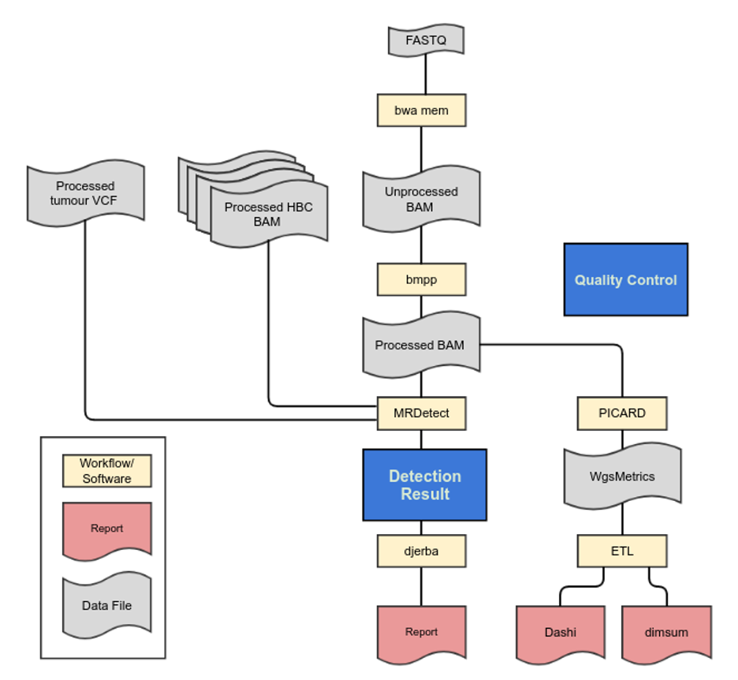

#############################################################
Plasma Whole Genome (pWGS) version |pwgs-version|
#############################################################

.. _plasma-pipeline:

	**Plasma Whole Genome Analysis Pipeline.**

1.	The plasma whole genome pipeline commences once the bcl2fastq workflow is completed and FASTQ files are available (not shown). 
2.	FASTQ files are quality controlled using FastQC. FastQC produces quality control metrics related to reads (e.g. total numbers of reads).
3.	FASTQ files are aligned with BwaMem to generate an unprocessed lane-level BAM file. 
4.	Cases are quality controlled with the bamQCworkflow generating a JSON file of alignment QC metrics for review. The quality control metrics include the insert size distribution, amount of duplication, mapping percentage, and other WG ‘Single Lane’ metrics described in QM. Quality Control and Calibration Procedures.
5.	Cases are quality controlled again with bamQC running on the merged set of all lane-level alignments generating a JSON file of call-ready alignment QC metrics for review. In addition to the lane-level QC metrics this includes an assessment of the per-sample depth of coverage (QM. Quality Control and Calibration Procedures).
6.	All lane-level BAM files are collected and processed via BamMergePreProcessing, which merges and sorts lane-level BAMs, as well as performing duplicate marking, and base quality score recalibration to generate a call-ready sample-level BAM.
7.	The plasma whole genome BAM file and an existing whole genome sequencing vcf file from matched donor are used as input for the mrdetect workflow.

	a.	MRDetect detects SNVs from WGS VCF in plasma BAM
	b.	MRDetect detects SNVs from WGS VCF in healthy blood control (HBC) cohort
	c.	Metrics are computed on the confidence of minimal residual disease detection

8.	All alteration files are provided to Djerba to generate a provisional clinical report for review by genome interpreters.

pWGS Workflows and Software
-----------------------------

More information about the analysis pipelines is available in the ‘Procedure’ section below. Workflow parameterization is automated through the linked Shesmu configuration. This repository is restricted to authorized individuals.

.. csv-table:: Plasma Whole Genome Sequencing Software
   :file: software/pwgs.csv
   :widths: 30, 30, 30, 30, 30
   :header-rows: 1