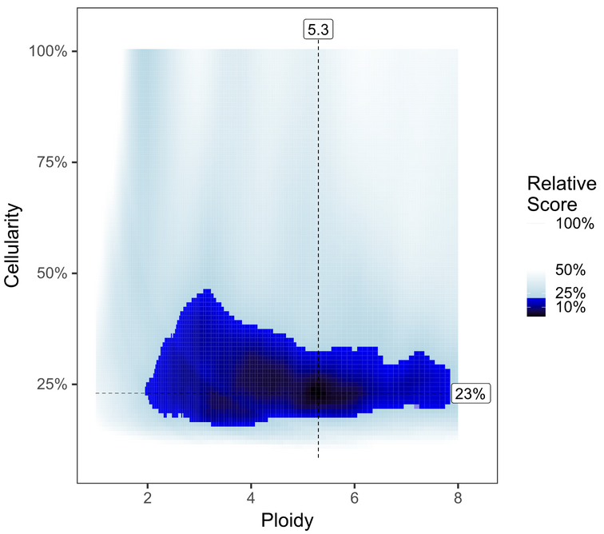
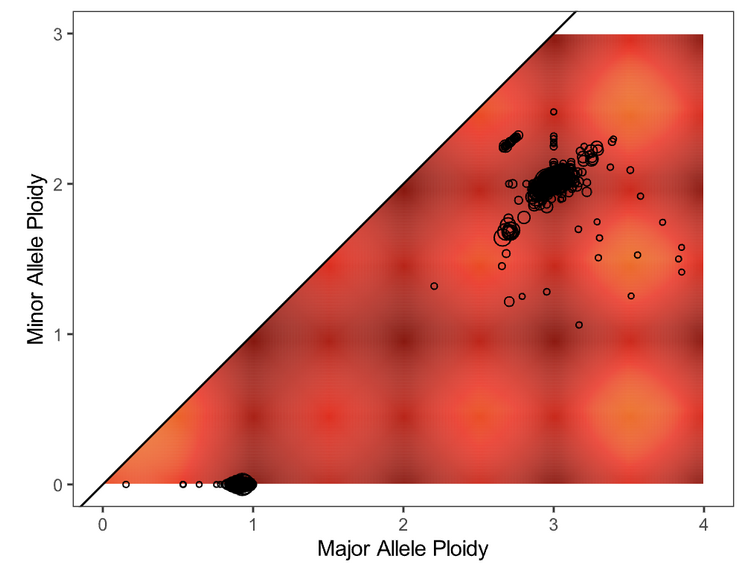
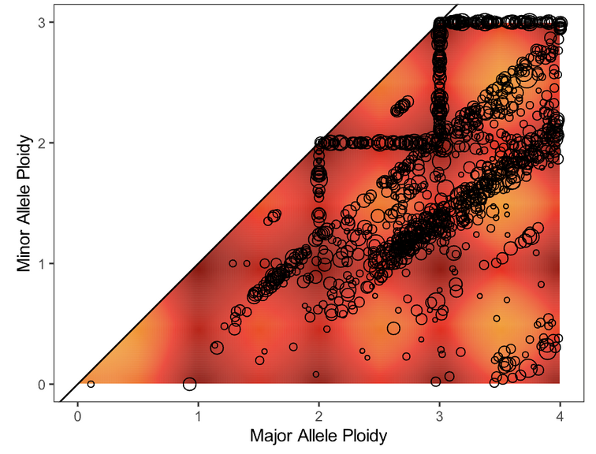

#########
Tips
#########

.. _purple-range:

Review PURPLE range for cell content solution
+++++++++++++++++++++++++++++++++++++++++++++

To review solutions, open the file ``purple.range.png`` in the working directory. The contour plot shows the relative likelihood for different purity/ploidy solutions (based on PURPLE’s penalty scoring). PURPLE’s favored solution is shown at the intersection of the dotted line. Highly probable solutions have low scores, and appear as black or dark blue areas (or “peaks” on the contour plot). Less preferable plots have multiple peaks close together, with little distinction between them. Further guidelines for picking alternate solutions are outlined in the following table:

.. list-table:: Purple plots
   :widths: 50 20 30
   :header-rows: 1

   * - Plot
     - Action
     - Guidance/Reasoning
   * - |good-cell-img|
     - None
     - |good-cell-txt|
   * - |alt-cell-img|
     - Consider an Alternate solution
     - |alt-cell-txt|
   * - |bad-cell-img|
     - | Fail the Sample
     - |bad-cell-txt|

.. |good-cell-img| image:: images/good-cell.png
.. |good-cell-txt| replace:: Both plot and solution look good.
.. |alt-cell-img| image:: images/alt-cell.png
.. |alt-cell-txt| replace:: There seems to be a viable alternate solution around 75% / N=2 which may rescue this sample from failing otherwise. See instructions below to launch runs of purple with alternate cellularity/ploidy combinations. 

.. |bad-cell-txt| replace:: While some solutions are above 30% cellularity, this nebulous cloud shape on a mostly blue background suggests the algorithm had trouble prioritizing solutions and the likely true solution is below 30%.

.. _purple-segmentQC:

Review PURPLE Segment QC for fit
+++++++++++++++++++++++++++++++++++

Next, evaluate the fit of the solution to the data by opening the file ``purple.segment_QC.png``. The plot depicts the likelihood (as a penalty) of minor and major allele copy numbers based on the chosen cellularity/ploidy solution and the observed data. A heatmap showing which copy number regions have a high probability of containing segments, according to the predictive model generated, is overlaid by the observed segments (plotted as circles representing the size of the segment in number of supporting variants). 

Preferred solutions have a close match between observation and prediction; that is, most segments occur in red/yellow regions (high probability), not white regions (low probability). It is ideal but not necessary for all segments to occur in high-probability regions of a solution. 

.. list-table:: Evaluating the fit of the segments of a chosen cellularity/ploidy solution
	:widths: 50 20 30
	:header-rows: 1 

	* - Plot
	  - Action
	  - Guidance/Reasoning
	* - |good-ploidy-img|
	  - None
	  - |good-ploidy-txt|
	* - |alt-ploidy-img|
	  - Consider an Alternate solution
	  - |alt-ploidy-txt|
	* - |bad-ploidy-img|
	  - Fail the Sample
	  - |bad-ploidy-txt|

.. |good-ploidy-img| image:: images/good-ploidy.png
.. |good-ploidy-txt| replace:: Fit looks good

.. |alt-ploidy-txt| replace:: Large distance between clusters of alleles will lead to an unlikely CNV track

.. |bad-ploidy-txt| replace:: This sample appears to be hypersegmented. While this can occasionally be a biological phenomenon (like HRD), it is more likely that this sample is of low purity and that segments were not merged in PURPLE because breakends were missed since their structural variants were at low VAF. Check the mutations list in case the high segmentation can be explained by a DNA repair deficiency (eg. BRCA1 knockout).

