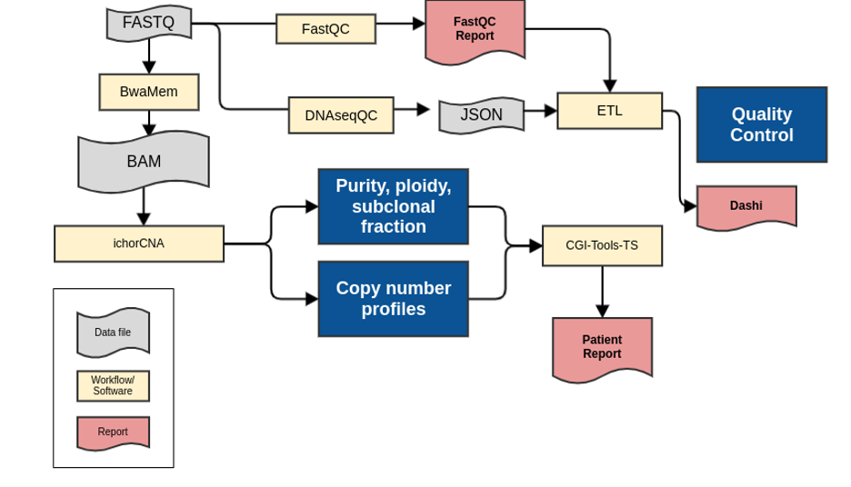

#############################################################
Shallow Whole Genome (sWGS) version |shallow-version|
#############################################################

.. _shallow-pipeline:

	**Shallow Whole Genome Analysis Pipeline.**

1.	The shallow whole genome pipeline commences once the bcl2fastq workflow is completed and FASTQ files are available. 
2.	FASTQ files are quality controlled using FastQC. FastQC produces quality control metrics related to reads (e.g. total numbers of reads)
3.	FASTQ files are aligned with BwaMem to generate an unprocessed lane-level BAM file. 
4.	Data is quality controlled with the bamQC workflow generating a JSON file of alignment QC metrics for review. The quality control metrics include the insert size distribution, amount of duplication, mapping percentage, and other WG ‘Single Lane’ metrics described in QM. Quality Control and Calibration Procedures.
5.	The BAM files are processed with ichorCNA to estimate tumour fractions in ultra-low pass whole genome sequencing (WGS) and prediction of large-scale copy number variation (CNV).
6.	All alteration files are provided to Djerba to generate a provisional clinical report for review by genome interpreters.

sWGS Workflows and Software
----------------------------

* Human Genome Reference: |hg38-version|
	* Source: |hg38-ref-remote|
	* Local fasta: |hg38-ref-local|

.. csv-table:: Shallow Whole Genome Sequencing Software
   :file: sWGS-software.csv
   :widths: 30, 30, 30, 30
   :header-rows: 1