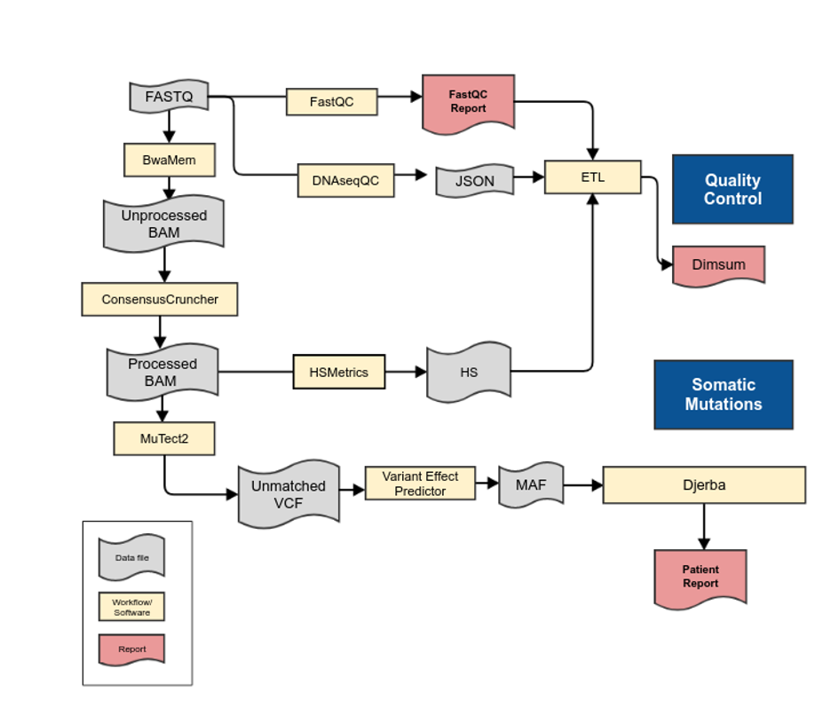

#############################################################
Targeted Sequencing (TAR) version |tar-version|
#############################################################

.. _tar-pipeline:

	**Targeted Sequencing Analysis Pipeline.**

1.	As with the WGTS informatics pipeline, the targeted sequencing pipeline commences once FASTQ files are generated from bcl2fastq. 
2.	FASTQ files are aligned with BwaMem to generate an unprocessed lane-level BAM file.
3.	Cases are quality controlled with the bamQC workflow generating a JSON file of lane-level alignment QC metrics for review. The quality control metrics include the insert size distribution, amount of duplication, mapping percentage, and other TAR ‘Single Lane’ metrics described in QM. Quality Control and Calibration Procedures.  Genomic fingerprints are generated from lane-level alignments and made available to sample authentication procedures.
4.	All lane-level BAM files are collected and processed via BamMergePreProcessing, which merges and sorts lane-level BAMs, as well as performing  duplicate marking, and base recalibration to generate a call-ready sample-level BAM.
5.	The FASTQ files are also processed with ConsensusCruncherWorkflow to generate UMI-tagged and consensus-collapsed bam files. The ConsensusCruncherWorkflow  uses MuTect2 followed by Variant Effect Predictor to generate raw call files, and HSMetrics to generate collapsed coverage metrics. For variant calling, the duplex consensus sequences and single-stand consensus sequence with singleton corrected bam files are used to generate raw calls, which are then annotated with the variant allele frequency from the all-unique bam file.
6.	All alteration files are provided to Djerba to generate a provisional clinical report for review by genome interpreters.

TAR Workflows and Software
---------------------------

* Human Genome Reference: |hg38-version|
	* Source: |hg38-ref-remote|
	* Internal fasta: |hg38-ref-local|
* REVOLVE panel: |revolve-panel-paper|
   * Internal link: |revolve-panel-local|

.. csv-table:: Targeted Sequencing Software
   :file: software/tar.csv
   :widths: 30, 30, 30, 30, 30
   :header-rows: 1
