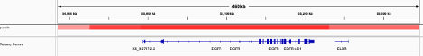
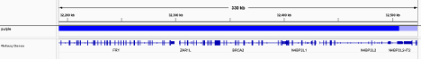

Creating Whole Genome Transcriptome Sequencing (WGTS) Reports
===================================================================

.. _wgts-ini-config:

Djerba INI configuration
~~~~~~~~~~~~~~~~~~~~~~~~~~~~~~~~~~~

The config.ini file created in :ref:`djerba-working-dir` is empty by default and some fields must be filled by the CGI staff. The INI can be edited either in the command line (using nano or vim) or using a text editor.  An empty INI is shown below. Values shown as REQUIRED must be filled in by the CGI staff. The example file was generated for the WGTS assay. It is an illustrative example only; plugin parameters may change from time to time. The automatic setup in Step 1 will create a config.ini file with up-to-date parameters::

	[core]

	[input_params_helper]
	assay = REQUIRED
	donor = REQUIRED
	oncotree_code = REQUIRED
	primary_cancer = REQUIRED
	project = REQUIRED
	requisition_approved = REQUIRED
	requisition_id = REQUIRED
	sample_type = REQUIRED
	site_of_biopsy = REQUIRED
	study = REQUIRED

	[wgts.cnv_purple]

	[report_title]

	[patient_info]

	[expression_helper]

	[provenance_helper]

	[wgts.snv_indel]

	[genomic_landscape]

	[case_overview]

	[fusion]

	[hla]

	[sample]

	[summary]

	[supplement.body]

	[gene_information_merger]

	[treatment_options_merger]

The underlying INI syntax conforms to the Python ConfigParser_ module. Empty parameters do not require specification and can be left out of the .ini – section headers (denoted by square brackets) are used by Djerba to discover which plugins to load and therefore must be included even if all parameters are left blank. 

.. _ConfigParser: https://docs.python.org/3/library/configparser.html

Summary of INI parameters:
***************************

The parameters below are entered in the ``[input_params_helper]`` section of the INI file and the information is obtained either from one of two Data Sources: the Requisition (Req) system or Dimsum.

===================== ================================================================================ ===============
INI parameter          Description                                                                      Data source
===================== ================================================================================ ===============
assay                  One of WGTS, WGS, TAR, PWGS                                                      Req system
donor                  Donor LIMS ID, eg. PANX_1249                                                     Dimsum
oncotree_code          OncoTree code, case-insensitive (eg. paad)                                       Req system
requisition_approved   Date of first requisition approval by Tissue Portal staff in yyyy-mm-dd format   Req system
project                name of the project in provenance                                                Dimsum
requisition_id         I.D. in requisition system                                                       Req system
sample_type            Select submission type                                                           Req system 
primary_cancer         Select primary cancer type                                                       Req system
site_of_biopsy         Site of biopsy/surgery                                                           Req system
study                  Name of study (acronym) in requisition system                                    Req system
===================== ================================================================================ ===============

Obtaining parameters from the requisition system
**************************************************

1. Login using your OICR username and LDAP at https://requisition.genomics.oicr.on.ca/ 
2. From the dashboard submissions tab, navigate to the project
3. Refer to Dimsum to find the “Requisition ID” within the requisition system, eg. `PANX_1608`_ -> PRSPR-427.
4. Find the case in the requisition system, click “View”, and scroll down to view information:

.. _PANX_1608: https://dimsum.gsi.oicr.on.ca/donors/PANX_1608

Completed ``[core]`` and ``[input_params_helper]`` sections in the INI file::

	[core]

	[input_params_helper]
	assay = WGTS
	donor = PANX_1249
	oncotree_code = paad
	primary_cancer = Pancreatic Adenocarcinoma
	project = PASS01
	requisition_approved = 2021-03-29
	requisition_id = PASS01UHN-115
	sample_type = LCM
	site_of_biopsy = Liver
	study = PASS-01

For further details on the INI file, or how to troubleshoot when discovered parameters don’t fill automatically, see `Djerba documentation`_.

.. _Djerba documentation: https://djerba.readthedocs.io/en/latest/

.. _wgts-ireport-gen:

Interim Report Generation
~~~~~~~~~~~~~~~~~~~~~~~~~~~~~~~~~~~

With the completed .ini, generate the interim report according to the following steps:

1. Login and setup the analysis environment on a Univa compute node, as described in :ref:`djerba-working-dir`.
2. Run the djerba.py script using the INI file completed in :ref:`wgts-ini-config` and the ‘report’ subdirectory created in :ref:`djerba-working-dir` ::

	$ djerba.py report -i  my/path/config.ini -o /my/output/dir/ -p 

Output filename is of the form ``${TUMOUR_ID}+${version}.html`` in the report directory.

.. _wgts-ireport-review:

Review Tumour Quality
~~~~~~~~~~~~~~~~~~~~~~

In the “Sample Information” section, review sample quality information for the tumour. 

CGI staff are responsible for verification of two quality metrics - Callability and Estimated Cancer Cell Content. If a case does not pass either metric, it cannot continue with the assay and must be failed.

Callability
^^^^^^^^^^^

*Callability* is defined as the percentage of bases with at least 30X coverage in the tumour. Callability is calculated in pipeline and recorded in QC-ETL. This value is automatically retrieved by Djerba. Verify the value in the Djerba provisional report passes the necessary threshold (as defined in QM-0024. Quality Control and Calibration Procedures SOP).

.. note:: 
	If a sample’s callability falls below that threshold but qualifies under the “Callability Metric Override” outlined in QM-0024, the clinical report will still be generated and issued normally, without requiring a planned deviation. When signing off on analysis review, add a note to the QC report stating that the sample meets callability override metrics and that the report passes.

Estimate Cancer Cell Content
^^^^^^^^^^^^^^^^^^^^^^^^^^^^

In the process of estimating cancer cell content, most software evaluate many ploidy/purity solutions. The CGI staff will need to evaluate whether the best solution was chosen by the software.  If the chosen cancer cell content is below the threshold in QM. Quality Control and Calibration Procedures SOP, a failed report should be generated (see :ref:`wgts-failed-report`). Estimated Cancer Cell Content must also be recorded in MISO by staff (:ref:`wgts-record-miso`)

The default primary solution is typically preferred, but the following are important considerations:

* Prioritize solutions close to diploid (N=2); generally, lower ploidy solutions are preferred to higher ploidy. Ploidies ≥ 5N with low purities should be investigated with high skepticism. 
* Compare cancer cell content to the VAF of driver mutation: while PURPLE does consider the VAF distribution in choosing a solution, known common mutations with LOH (such as TP53) are informative markers of the sample’s cancer cell content. The VAF of variants with LOH often reflects the tumor purity.

Common signals in the VAF distribution that something is wrong:

===================================== ======================= ========================
Abnormality                           Potential Cause         Action
===================================== ======================= ========================
Skewed distribution towards 0% VAF    Low purity              Confirm purity > 30%
Excessive VAFs at 50% and 100%        Germline Contamination  Check for swap
===================================== ======================= ========================

Procedure
++++++++++

Investigate the PURPLE :ref:`purple-range` and :ref:`purple-segmentQC` plots to see whether the default solution is optimal.

.. _alt-solution:

When an alternate solution is better:

#. Open purple.range.txt and scroll down until you find the top scoring solution in the area of the plot of your alternate solution. If you are hesitating whether to consider an alternate solution, check how far down the alternate solution is from the top. The closer the solution is to the top (i.e. the lower the score), the more confident you can be about selecting that alternate solution.
#. Search file_provenance for the alternate solutions directory::

	file_provenance=/scratch2/groups/gsi/production/vidarr/vidarr_files_report_latest.tsv.gz
	zcat $file_provenance | grep ${donor} | grep .purple_alternates.zip | cut -f 1,2,8,14,19,31,47

#. Unzip the alternate directory and manually assign the purple outputs in the .ini. Solutions directories are labeled according to their ploidy; if your favoured solution has a ploidy between 1-2, choose ``sol1``; between 2-3, choose ``sol2`` etc. Specify your solution in the INI using::

	[wgts.cnv_purple]
	purple_zip = ${NAME}.purple.zip

#. Relaunch Djerba

If you still don’t like your solution, PURPLE can be relaunched manually, specifying the wanted purity and ploidy in the ``workflow.json`` for deployment in cromwell. Alternate solutions can be launched according to the following procedure

#. Open purple.alternate.json and change the min/max purity/ploidy parameters in the .json to match with your desired solution
#. Launch cromwell on the HPC with `purple.wdl`_ using the following::

	module load cromwell
	java -jar $CROMWELL_ROOT/share/cromwell.jar submit purple.wdl \
	 --inputs purple.alternate.json \
	 --host http://cromwell-dev-2.hpc.oicr.on.ca:8000 >purple.alternate.txt

#. Retrieve the workflow outputs from the workflow manager http://cromwell-job-manager-dev.gsi.oicr.on.ca:4202/jobs using the workflow ID in purple.alternate.txt. 
#. Complete the procedure as in `alt-solution`_ above.

.. _purple.wdl: https://github.com/oicr-gsi/purple/blob/main/purple.wdl 

Interim Report Review and Interpretation
~~~~~~~~~~~~~~~~~~~~~~~~~~~~~~~~~~~~~~~~~~~~~~~~~~~~~~~~~~~~~~~~~~~~~~

Proceed with review of all informatics results using the HTML output. In this step, biomarker calls are manually reviewed in order to write the genome interpretation statement later.  

Genomic Landscape
****************************************************

#.  Note the percentile which the tumour mutation burden (TMB) is in, for the given tumour type. Refer to expected median TMB for the given tumour type in TCGA if it exists.
#. Evaluate actionable biomarkers for reporting: Oncokb reports TMB > 10 and MSI-H, and NCCN reports HR-D, as actionable. 

* Large confidence intervals around the MSI score (spanning several result-interpretations, for example both MSI and MSS) are to be considered inconclusive. Inconclusive samples may be sent for PCR confirmatory testing.
* If HRD or MSI are positive, look for a somatic driver mutation: BRCA1, BRCA2, RAD51C, RAD51D, or PALB2 for HRD and MLH1, MSH2, MSH6, or PMS2 for MSI. If no mutations are reported within these genes, consider manually verifying filtered calls in IGV. There won’t always be one: the mutation may be germline or the phenotype may arise from methylation, among other explanations.

c. Always include a comment on MSI status, whether it is classified as MSI-High or Inconclusive. If the confidence interval spans multiple interpretations (e.g., overlaps both MSI and MSS thresholds), it should be explicitly described as inconclusive, and consideration should be given to PCR-based confirmatory testing.

SNVs and IN/DELs
****************************************

a. SNVs and INDELs are reported according to the following filtering criteria:

.. list-table:: SNVs and InDels
	:widths: 30 70
	:header-rows: 1

	* - Filter 
	  - Threshold
	* - Variant Allele Frequency (VAF)
	  - ≥ 10% for SNVs and  ≥ 20% INDELs
	* - Supporting Reads
	  - ≥ 3 alt reads / ≥ 8 total reads; ≥ 4 reads in normal
	* - OncoKB
	  - * All level 1-4, R variants which pass the above criteria
	    * All “Oncogenic”, “Likely Oncogenic” and “Predicted Oncogenic” alterations which pass the above criteria

b. Review all actionable and/or oncogenic mutations using Whizbam links for alignment artifacts. Whizbam links can be navigated from the data_mutations_extended_oncogenic.txt file. Alterations which are deemed artifacts are to be removed from the data_mutations_extended.txt file and recorded into a new file labeled ``data_mutations_failed.txt``. The data_mutations_extended.txt file has more than 100 columns and can be difficult to navigate; for convenience, the whizbam links for all mutations, and oncogenic mutations, are copied to whizbam_all.txt and whizbam_oncogenic.txt respectively.

Dinucleotide substitutions which are represented as two individual mutations are to be merged. Merged variants should be recorded in a new file named data_mutations_merged.txt. Copy both original individual annotations to this file, along with a third record of the final merged variant. To perform this merge, please follow this step-by-step procedure in the `Merging and Annotating Mutations Representing the Same Event`_ document on CGI:How-to wiki page.

.. _Merging and Annotating Mutations Representing the Same Event : https://wiki.oicr.on.ca/spaces/GSI/pages/293634774/Merging+and+Annotating+Mutations+Representing+the+Same+Event

Copy Number
**********************

Review all Copy Number Variants by dragging the file `purple.seg` into your IGV browser. Evaluate each gene by inputting the name of that gene in the Location box of the browser. 

Consider whether the segment, as outlined in the window labeled “purple”, includes the entire gene.

Above, the deep red section perfectly aligns with the gene EGFR in the Refseq window, supporting that the amplification indeed covers the entire gene. 

Deletions follow a similar logic: ensure the entire gene is bracketed by the deletion, as exemplified by the BRCA2 deletion in deep blue above.

If CNVs are partial, consult OncoKB or other relevant literature to explore whether partial deletions/amplifications are as oncogenic as full ones. If you find they are not, the CNV can be manually removed from the JSON.

Fusion and Structural Analysis
*******************************

.. image:: images/fusions1.png
	:width: 100%

a. The Whizbam links for fusion partners can be found in the ``report/fusion_blurb_urls.tsv`` file. Open this TSV file and copy the desired link into your browser to access the corresponding visualization.
b. Load the ``arriba/fusions.tsv`` file and review the following columns:

	* Confidence: Indicates the reliability of the predicted fusion.
	* Coverage: Describes the total number of reads supporting the fusion.
	* Number of split reads and discordant mates: Reflects the evidence for the fusion event.

	For guidance on interpreting the Arriba results, refer to the instructions available here_.

.. _here: https://wiki.oicr.on.ca/display/GSI/Interpret+Arriba+fusions

c. In the Whizbam window, choose a read from one side of the fusion and click ‘View mate in split screen’. Ensure both mates map well by assessing for alignment artifacts such excessive numbers of mismatches or ambiguous mapping. If an alignment looks like an artifact:

* Perform a BLAT analysis of the supporting reads to ensure alignments map non-ambiguously to this region. To do this, right click on the read and select ‘Blat read sequence’. This will perform a sensitive search for alternative alignments that the aligner did not report. Reads with multiple alignments are likely artifacts. 
* if the fusion is predicted by the arriba program, copy arriba’s ``fusions.pdf`` file into the ``MAVIS/`` directory and check read support (coverage >=10X). Oncogenic fusions are generally highly expressed, as such a high coverage value is evidence of a true positive. Alterations which are deemed artifacts should be removed from the ``report/data_fusions_oncokb_annotated.txt`` file and the ``djerba_report.json`` and recorded into a new file labeled ``data_fusions_failed.txt``.

Review Known Variants
**********************

If prior knowledge of previous sequencing results or biomarkers is known, review the relevant sections of the report to confirm and note abnormalities:

.. list-table:: djdj
	:widths: 30 30 40
	:header-rows: 1

	* 	- Abnormality
		- Potential Cause
		- Action
	* 	- Lack of expected alteration, or presence of a mutation where the mutation is expected or not expected
		- * Lack of coverage for the expected mutation
		  * Sample swap
		  * Mutation is filtered
		- * Verify coverage for the region by inspecting the bam file in Whizbam
		  * Whizbam links appear in the rightmost column of the ``data_mutations_extended_oncogenic.txt`` intermediate data file
		  * Check for sample swaps
		  * Confirm mutation was not removed by pipeline by reviewing the MuTect2 VCF file
	* 	- Prior sequencing results are not confirmed
		- * Low coverage for the expected mutation
		  * Sample swap
		  * Mutation is filtered
		- * Verify coverage for the region by inspecting the bam file in Whizbam
		  * Check for sample swaps
		  * Confirm mutation was not removed by pipeline by reviewing the MuTect2 VCF file

If a discrepancy is noted, the sample should be marked as failed in MISO according to the QM. Quality Control and Calibration Procedures SOP. The report is to be regenerated with the FAIL flag as in section 2.1e.

.. _wgts-record-miso:

Update Informatics Review QC in MISO
*************************************

Once everything is reviewed, update Informatics Review in MISO. According to the QM. Quality Control and Calibration Procedures SOP, CGI Staff will: 

i. Follow dimsum link to requisition in MISO
ii. record the estimated cell content by (1) selecting all tumour tissues and (2) clicking Add QCs - with 1 QC per sample, and 0 controls per QC, (3) entering the Purity as a Result on the following web page, and clicking Save.  
iii. Add QC to the requisition, marking the Informatics Review as ‘Pass’ or ‘Fail’. 

Draft Report Generation
~~~~~~~~~~~~~~~~~~~~~~~~~~~~~~~~~~

This section is to be performed by CGI staff.

1. Generate an interpretation statement based on the findings from above. Include summaries of landscape, snv/indel, structural alterations, and copy number analysis.  You can use blurbomatic to generate this statement. If needed, blurbomatic can be cloned from this_ repository. To run it, use::
	
	blurbomatic.py < ${REQUISITION_ID}_v1_report.json

a.  Edit the generated interpretation statement if needed and save it under ``results_summary.txt`` in the report subdirectory of the working directory created in Section 1.
b. The interpretation statement may include simple HTML tags such as hyperlinks, bold/italic formatting, etc.
c. Use the following template as an example and refer to the wiki page on how to write a Genome Interpretive Statement for more details:

.. _this: https://github.com/oicr-gsi/blurbomatic

.. list-table:: Template for writing Genome Intrepretive Statement
	:widths: 20 80
	:header-rows: 1

	* 	- Analysis Subsection
	  	- Example statement
	* 	- Biological discrepancies
	  	- “The expected purity based on the pathologists’’ review is >80%, however, the inferred purity is below 40%. Variants are expected to have lower than expected VAFs”
	* 	- Genomic landscape (step 3)
		- “This tumour has a TMB of xxx coding mutations per callable Mb which corresponds to the xxx percentile for $CANCER_TYPE. Genomic biomarker analysis returned no actionable biomarkers.”
	* 	- SNV/Indel (step 4)
		- “Small mutation analysis uncovered loss of function mutations in xxx genes that suggest xxx.”
	* 	- Fusions and structural alterations (step 5)
		- “Fusion analysis of RNA transcripts uncovered alteration of xxx genes that suggest xxx”
	* 	- Integrated copy number and expression analysis (step 6)
		- “Integrated copy number and gene expression analysis uncovered alteration of xxx genes that suggest xxx”.
	* 	- OncoKB treatment recommendations
		- Statements are taken from oncoKB: “Alteration xxx is a Level 1 mutation which the following treatment recommendations according to oncoKB”

2. Generate the PDF report with the interpretation changes and files:

* Edit results_summary.txt if needed.
* Review and update report.json as necessary. For example, if a variant passes automated thresholds and appears in the report, but manual review determines it to be an artifact or not clinically significant, remove it manually from the JSON. Make any other required edits as well.

To make the JSON easier to read and edit, open it in your IDE or run::

	cat report.json | python3 -m json.tool > report_pretty.json

This will format the file for easier modification in a text editor.

* Use the main djerba.py script in update mode, to generate revised JSON file::

	$ djerba.py update -s report/results_summary.txt -j report/report.json -o report/ 

* Use the main djerba.py script in render mode, to generate revised PDF file::

	$ djerba.py render -j report/report.updated.json -o report/ -p

If necessary, the intermediate HTML file produced by Djerba may be also edited by hand. (This should only be done rarely, to resolve major formatting issues.) An HTML to PDF converter such as ``wkhtmltopdf`` may then be used to generate the PDF file. In this case, any subsequent edits by the clinical geneticist must be applied directly to the PDF, and not done with mini-Djerba.

Example Djerba session
~~~~~~~~~~~~~~~~~~~~~~~~~~~~~

The following is an example sequence of commands used to generate a clinical report with Djerba. It is intended as a guide to CGI staff for report generation. The commands are for illustration only, not a fixed script to be followed. Comments are prefixed with #::

	$ ssh ugehn.hpc
	$ sudo -u svc.cgiprod -i
	$ qrsh -P gsi -l h_vmem=16G
	$ module load djerba
	$ cd /.mounts/labs/CGI/cap-djerba/PASS01
	$ mkdir -p PANX_1249/PASS01UHN-115
	$ cd PANX_1249/PASS01UHN-115
	$ mkdir report
	$ djerba.py setup -a WGTS -p ../../PASS-01-config.ini --compact
	# edit the config.ini file as detailed in the SOP
	nano report/config.ini
	# generate a draft report with Djerba; --verbose flag is optional, but gives helpful status updates
	$ djerba.py --verbose report -i config.ini -o ./report
	# review the HTML and edit the genomic_summary.txt file
	$ nano report/results_summary.txt
	$ djerba.py update -s report/results_summary.txt -j report/report.json -o report/ -p

.. _wgts-failed-report:

Failed Reports
~~~~~~~~~~~~~~~~~~~~~~~~

If the report fails any QC metrics or fails for another reason, a failed report must be submitted to the requisition system.

To generate a failed report for WGTS, fill out the following ini (note: purity, ploidy, callability, and mean_coverage under the [sample] plugin can accept NA if required)::

	[core]
	[input_params_helper]
	assay= 
	donor= 
	requisition_id= 
	study= 
	project= 
	oncotree_code=

	primary_cancer= 
	sample_type= 
	site_of_biopsy= 
	requisition_approved= 
	[report_title]
	failed = True
	[patient_info]
	[provenance_helper]
	[case_overview]
	[sample]
	purity = 
	ploidy = 
	[summary]
	failed = True 
	summary_file = results_summary.txt
	[supplement.body]
	failed = True

Edit the ``results_summary.txt`` file to describe the reason for failure. Ensure that the reason for failure is clearly identified in the report summary. For example:

	“The patient has been diagnosed with Pancreatic Adenocarcinoma and has been referred for the OICR Genomics WGTS assay through the PASS-01 study. A quality failure report for this sample is being issued due to the informatically inferred tumour purity of 25%: this value is below the reportable threshold of 30% for the assay.”

.. note:: 
	Refer to this wiki page for more examples.

Run the ``config.ini`` as usual with the Djerba command::

	djerba.py report -i config.ini -o report/ -p 